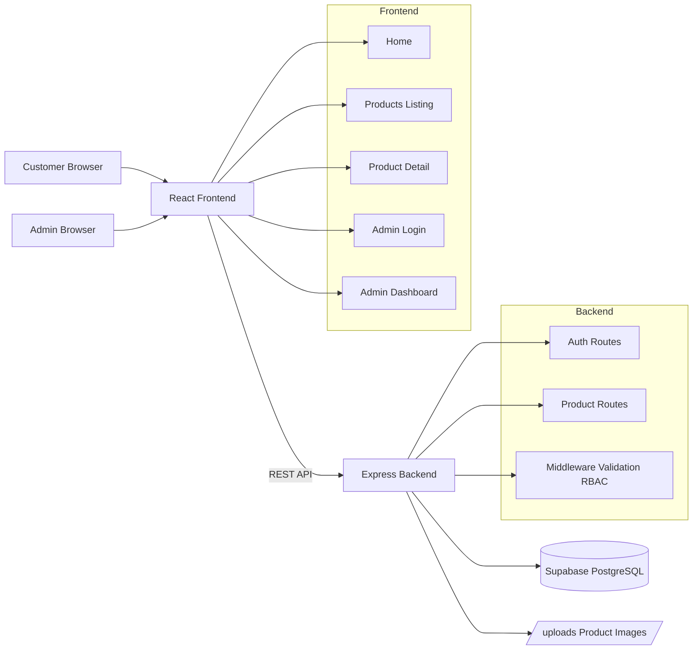
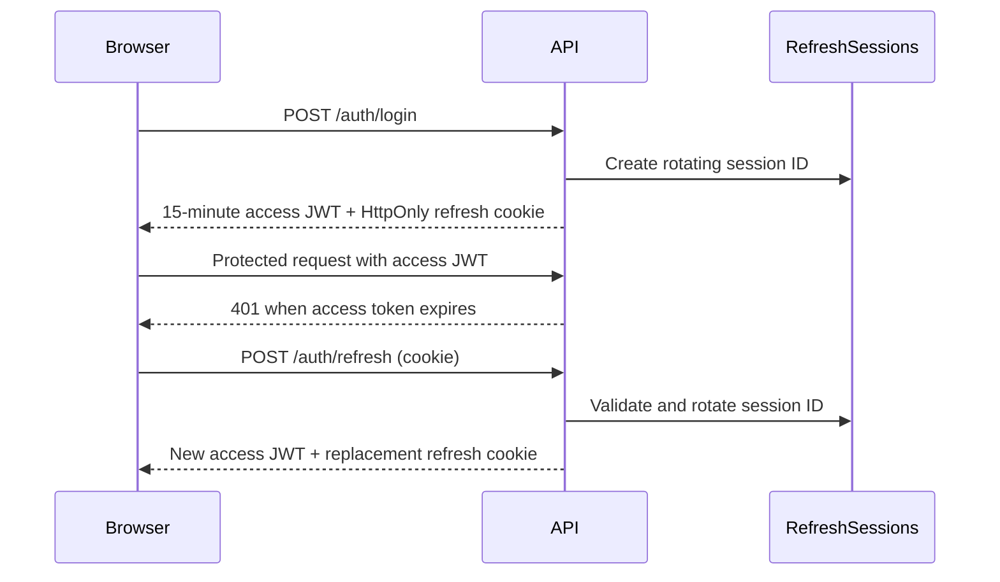

# Vaishnavi Silk Emporium

Premium saree shopping platform with a role-based customer storefront and store-management portal.

- Guest browsing with protected pricing
- User authentication, profile, wishlist, availability alerts, dark mode, and Telugu support
- Saree catalog with fabric, weave, colour, occasion, care, and rating details
- Admin management for sarees, inventory, categories, reports, and settings
- Express REST API with JWT access tokens, rotating refresh sessions, RBAC, and OAuth support

## Quick Start

Backend terminal:

```bash
cd "backend"
cp .env.example .env
npm install
DATABASE_URL="postgresql://..." npm run seed
DATABASE_URL="postgresql://..." PORT=4010 npm start
```

Frontend terminal:

```bash
cd "frontend"
npm install
VITE_API_URL=http://localhost:4010/api npm run dev
```

The API runs at `http://localhost:4010`; Vite runs at `http://localhost:5173`. Demo accounts are `customer` / `Customer@12345` and `admin` / `Admin@12345`.

## QA and API Testing

Import the generated Postman collection and select the matching environment:

- `docs/Vaishnavi-Silk-Emporium.postman_collection.json`
- `docs/Vaishnavi-Development.postman_environment.json`
- `docs/Vaishnavi-UAT.postman_environment.json`
- `docs/Vaishnavi-Production.postman_environment.json`

Run **Authentication / Login** first to populate `{{accessToken}}`. See `docs/api-coverage.md` for implemented endpoint coverage, authentication flow, missing API groups, and standardization recommendations.

## Deployment

Deployment architecture, Vercel/Render configuration, Supabase schema, production environment variables, GitHub Actions validation, and the required PostgreSQL migration gate are documented in `docs/deployment.md`.

## 1. Application Architecture Diagram



## 2. Database Schema

### Products
- ProductId (PK)
- ProductName
- Description
- Category
- Price
- ImageUrl
- Quantity
- IsActive
- CreatedDate
- UpdatedDate

### Users
- UserId (PK)
- Username
- PasswordHash
- Role

Implemented in: backend/src/db.js

## 3. Frontend Design

- Sticky header with: logo, nav links, search box, admin login
- Hero section with clear CTAs
- Product listing grid with:
  - Real-time search
  - Category filter
  - Sorting (price asc/desc, alphabetical)
- Product details with image, description, availability, and price
- Admin dashboard with stats + CRUD + visibility toggle + inventory control
- Mobile/tablet/desktop responsive breakpoints
- Design tokens:
  - Primary: #0A66C2
  - Secondary: #FFFFFF
  - Accent: #FF7A00
  - Background: #F5F7FA

## 4. Backend API Design

Base URL: http://localhost:4000/api

### Auth
- POST /auth/login
- GET /auth/me

### Customer Product APIs
- GET /products/public
  - Query params: q, category, sort
- GET /products/public/:id

### Admin Product APIs (JWT + ADMIN role required)
- GET /products/admin
- GET /products/admin/summary
- POST /products/admin
- PUT /products/admin/:id
- DELETE /products/admin/:id

### Customer Cart APIs (JWT + USER role required)
- GET /cart
- POST /cart/items with `{ "productId": 1, "quantity": 1 }`
- PUT /cart/items/:id with `{ "quantity": 2 }`
- DELETE /cart/items/:id
- DELETE /cart

Cart totals are calculated server-side. Adding an existing product increases its quantity instead of creating a duplicate. Requested quantity cannot exceed available inventory.

### Admin Inventory APIs (JWT + ADMIN role required)
- GET /inventory
- GET /inventory/:id
- GET /inventory/low-stock
- PUT /inventory/:id with `{ "stock": 25 }`
- POST /inventory/update-stock
- POST /inventory/restock

Prices remain numeric in PostgreSQL and are formatted in the frontend with Indian Rupee formatting (`Intl.NumberFormat("en-IN", { style: "currency", currency: "INR", maximumFractionDigits: 0 })`).

## 5. Folder Structure

```text
backend/
  package.json
  .env.example
  src/
    auth.routes.js
    config.js
    db.js
    middleware.js
    products.routes.js
    seed.js
    server.js
    upload.js
    utils.js
  data/
  uploads/

frontend/
  package.json
  index.html
  vite.config.js
  src/
    App.jsx
    api.js
    auth.js
    styles.css
    components/
      Footer.jsx
      Header.jsx
      ProductCard.jsx
      ProductCardActions.jsx
      AddToCartButton.jsx
      CartContext.jsx
    pages/
      AboutPage.jsx
      AdminDashboardPage.jsx
      CartPage.jsx
      AdminLoginPage.jsx
      ContactPage.jsx
      HomePage.jsx
      ProductDetailPage.jsx
      ProductsPage.jsx
```

## 6. Responsive UI Screens

Implemented pages:
- Home Page
- Product Listing Page
- Product Detail Page
- Admin Login Page
- Admin Dashboard

Responsiveness:
- Desktop: 3-column cards + full header nav
- Tablet: 2-column adaptive layouts
- Mobile: single-column stack + sticky header + touch-friendly controls

## 7. Security Considerations

- JWT-based authentication for admin routes
- Role-based access control (ADMIN only)
- Password hashing using bcrypt
- Rate limiting on login
- Helmet security headers
- Input validation with express-validator
- File upload constraints (type + size)
- CORS origin restriction
- Server-side enforcement of active/inactive visibility

## 8. Deployment Steps

### Prerequisites
- Node.js 20+

### Backend
1. cd backend
2. npm install
3. cp .env.example .env
4. Update JWT_SECRET and admin credentials
5. npm run seed
6. npm run start

### Frontend
1. cd frontend
2. npm install
3. Create `.env` with `VITE_API_URL=http://localhost:4010/api`
4. npm run dev

### Production Build
1. frontend: npm run build
2. serve static frontend dist via CDN/Nginx
3. run backend behind reverse proxy with HTTPS
4. persist backend/data and backend/uploads volumes

### Current Vercel and Render Deployment

The frontend is deployed from `frontend/` as a Vite application on Vercel. Set this Vercel environment variable for Production, Preview, and Development as appropriate:

```dotenv
VITE_API_URL=https://vaishnavi-silk-emporium.onrender.com/api
```

Vite embeds this value at build time, so redeploy Vercel after changing it. Do not use `NEXT_PUBLIC_API_URL`; this is not a Next.js application. Confirm the generated frontend is calling `https://vaishnavi-silk-emporium.onrender.com/api`, not a localhost URL.

The backend is deployed from `backend/` on Render with `npm ci` and `npm start`. Configure Render with the Supabase pooler connection string:

```text
DATABASE_URL=postgresql://postgres.<project-ref>:<password>@<pooler-host>:6543/postgres
```

After pushing the latest code, redeploy Render and verify `GET https://vaishnavi-silk-emporium.onrender.com/api/health` reports PostgreSQL readiness and version information.

## 9. Sample Test Cases

### Authentication
- Valid admin credentials return JWT
- Invalid credentials return 401
- Missing token on admin endpoints returns 401

### Product Visibility
- Inactive products do not appear in /products/public
- Activating a product in admin dashboard makes it visible to customers immediately

### Pricing
- Update product price in admin dashboard
- Verify refreshed customer listing/detail shows updated price

### Search/Filter/Sort
- Case-insensitive partial search returns matching products
- Category filter narrows result set
- Sort options return expected order
- No results shows "No Products Found"

### Inventory
- Quantity 0 displays Out of Stock
- Quantity > 0 displays In Stock

### Uploads
- JPEG/PNG/WEBP accepted
- Unsupported file type rejected
- Oversized file rejected

## 10. Production-Ready Source Code

Source code is included in this workspace:
- backend/
- frontend/

## Environment Variables

Backend .env:
- PORT
- CLIENT_ORIGIN
- JWT_SECRET
- ADMIN_USERNAME
- ADMIN_PASSWORD

Frontend .env:
- VITE_API_URL

## Notes

- Default admin user is automatically created at backend startup if missing.
- Any admin product/price update is persisted immediately and reflected on customer endpoints.

## Admin Session Management

### Root Cause Analysis

The previous dashboard implementation cleared the browser token and navigated to login for **every** request error, including transient network or 5xx errors. The route guard only checked for the presence of a browser token and had no startup session validation or recovery mechanism. The app also used a single eight-hour access token with no refresh token support.

### Improved Architecture



### Security and UX Controls

- 15-minute access JWTs are held in `sessionStorage`, not persistent local storage.
- A signed, rotating refresh session is stored in an HttpOnly, SameSite cookie.
- The refresh session is persisted server-side in `RefreshSessions` and revoked during logout.
- `Remember me` controls whether the refresh cookie remains after the browser closes.
- App startup restores the user from `/auth/refresh`, so refreshes, direct protected URLs, and new tabs remain authenticated.
- Axios automatically refreshes once on a protected 401 and retries the original request.
- Route guards wait for session validation before redirecting.
- Logout is confirmed, clears local session state, revokes the server-side session, and signals other browser tabs.
- Dashboard API/network errors display a friendly message and do not log the user out.
- A two-minute expiry warning lets the admin refresh the session deliberately.

### Authentication Test Scenarios

- Log in with valid and invalid credentials.
- Navigate to dashboard after login; refresh the page; open the dashboard in a new tab; open a protected URL directly.
- Allow the access token to expire and verify the request is refreshed and retried.
- Delete or expire the refresh cookie and verify protected routes redirect to login.
- Log out in one tab and verify a second tab clears its admin session.
- Stop the API temporarily and verify the dashboard shows an error without logging out.
- Verify 401/403 responses deny protected API operations for unauthenticated/non-admin requests.

For production, run behind HTTPS and set `NODE_ENV=production`; this marks refresh cookies as `Secure`. Use a long, randomly generated `JWT_SECRET`, store it in a secret manager, and set `CLIENT_ORIGIN` to the exact frontend origin.

## Storefront and Admin Portal Navigation

The frontend now uses separate application shells instead of rendering customer navigation around every route.

- `PublicLayout` provides the customer header and footer for `/`, `/products`, `/products/:id`, `/about`, and `/contact`.
- `AdminLayout` provides the persistent admin menu for `/admin/*` and does not render customer navigation or footer.
- Authenticated admins who visit a public route are redirected to `/admin/dashboard`, keeping the portal context consistent.
- Guests visiting an `/admin/*` URL are redirected to `/admin/login` after the session check completes.
- The public `Admin Login` control is hidden after authentication; the dedicated admin header shows the profile name and logout control instead.
- Admin routes include Dashboard, Products, Inventory, Categories, Reports, and Settings. Products and Inventory use the existing product-management dashboard; the remaining routes provide scoped admin sections ready for their respective data modules.

## Role-Based Login

The storefront exposes one `/login` entry point. Login returns the authenticated user identity and role from the `Users` table.

- Guests see Home, Products, Search, and Login.
- `USER` accounts are redirected to `/` and see Home, Products, Profile, and Logout.
- `ADMIN` accounts are redirected to `/admin/dashboard` and remain in the dedicated admin shell.
- `/admin/*` requires an `ADMIN` role; non-admin users are redirected to Home.
- Session refresh preserves the user identity and role across navigation, browser refreshes, and tabs. Logout revokes the server-side refresh session and redirects to Home.

For local role testing, the seed creates `admin` as an `ADMIN` account and `customer` as a `USER` account. Their passwords are configured through `ADMIN_PASSWORD` and `USER_PASSWORD` respectively.

## Profile Management

Authenticated user data is stored in the `Users` table and returned by login, token refresh, and `/api/auth/me`. The profile experience includes:

- Header welcome message, profile avatar, and dropdown navigation after login.
- Initial-based circular avatar fallback when no photo has been uploaded.
- `PUT /api/auth/profile` for full name, display name, email, and JPG/PNG/WEBP avatar updates.
- `PUT /api/auth/password` for current-password verification and a new password of at least 10 characters with confirmation.
- Uploaded avatars use the existing 3 MB image constraint and are served from the backend uploads directory.
- Profile saves immediately update the active header and signal other browser tabs to refresh their user identity.

The application stores only short-lived access tokens in tab-scoped storage. Long-lived refresh sessions remain in HttpOnly cookies; profile passwords are bcrypt-hashed and never returned by the API.

## Customer Account Routes

- `/profile`: read-only account information, including profile image, identity, contact data, member date, last login, and role.
- `/settings/account`: editable account settings, avatar management, mobile number, and persisted notification/recommendation/language preferences.
- `/settings/security`: password update with current-password verification, confirmation, and a client-side strength indicator.
- `/wishlist`: server-persisted saved product list.
- `/recently-viewed`: locally persisted product view history populated from product detail pages.
- `/orders`: future-ready empty order history state.
- `/notifications`: future-ready price, arrival, and featured-product alert state.

Customer preferences, profile, wishlist, and cart data are persisted server-side. Recently viewed products remain browser-local; orders and checkout remain future-ready boundaries.

## Price Privacy and Registration

- Guest requests to public product APIs receive no `price` field. The storefront displays a `Sign In to View Price` action on catalog cards, featured products, and product details.
- Authenticated requests receive price and can use price-based sorting.
- `POST /api/auth/register` creates only `USER` accounts; it validates a unique email/mobile number and a password with upper/lowercase letters, a number, and a symbol. Admin accounts remain seed/system-managed.
- Sign-in accepts email, mobile number, or the existing username plus password.

Google and GitHub OAuth must be configured with provider-issued client IDs, client secrets, authorized redirect URIs, and a production HTTPS origin. These secrets are intentionally not implemented as placeholder credentials; adding OAuth without them would create an insecure or nonfunctional sign-in path.

## Back-in-Stock Notifications

The availability flow is persisted and event-driven within the product update transaction path:

1. An authenticated user opens an out-of-stock product and selects `Notify Me When Available`.
2. `POST /api/notifications/subscriptions/:productId` stores a `NotificationSubscriptions` record.
3. An admin inventory update compares the existing quantity to the new quantity.
4. Only the transition from `0` to a value greater than `0` creates `Notifications` records and marks matching subscriptions sent.
5. The user sees the alert at `/notifications`; the header bell polls unread count every 30 seconds.

Changing quantity from a positive number to another positive number creates no alert, and users without a subscription receive none. In-app delivery is implemented now; email and push delivery can consume the generated `Notifications` records in a future background worker without changing inventory logic.

## Wishlist and Notification Services

- `Wishlists` is a database-backed collection keyed by `UserId` and `ProductId`; the product detail button queries its saved state and immediately toggles between `♡ Save to Wishlist` and `♥ Remove from Wishlist` after the API response.
- `NotificationService` owns notification retrieval, unread counts, read state, and availability delivery. Inventory updates call `sendAvailabilityNotification()` only for a zero-to-positive stock transition.
- Notification subscriptions are deactivated after one delivery and can be reactivated if the product later becomes unavailable again.
- The header bell refreshes unread counts every five seconds without a page reload. The notifications page includes product names, View Product actions, read status, and mark-as-read controls.

Core verification scenarios:
- Add/remove a wishlist item, reload or sign in again, and confirm the product detail button reflects the database state.
- Subscribe multiple users while stock is zero, update stock to a positive value, and confirm one notification per active subscription.
- Update stock from positive to positive and confirm no availability notification is generated.

## Theme Persistence

`ThemeContext` centralizes the `light` and `dark` theme state. It applies `data-theme` and `color-scheme` to the document root immediately, stores the selected mode in local storage for pre-login refresh persistence, and restores the authenticated user's persisted `preferences.darkMode` value after login or session refresh. Account Settings applies the mode as soon as the checkbox changes; saving persists it through the existing user preferences API, and Cancel restores the last saved user preference.

## Authentication Initialization

On application startup, `AuthProvider` validates an existing access token with `/api/auth/me` before using `/api/auth/refresh` as a fallback. A valid session restores the complete user, profile, and role before route guards render. The session is cleared only after a confirmed `401` or `403`, never for a transient network failure.

- Standard login stores the short-lived access token and user identity in tab-scoped session storage; a refresh in that tab remains authenticated.
- `Remember me` stores the same client state in local storage and uses the persistent HttpOnly refresh cookie, which supports new tabs and browser restarts until expiration or explicit logout.
- Logout clears both storage scopes and revokes the server-side refresh session.

## Multilingual Support

The app supports English (default) and Telugu through `LanguageContext`. Static labels are held in a lazy in-memory dictionary, switch immediately from the header selector, and persist in both local storage and the existing `Users.Preferences` JSON (`language: English | Telugu`). Session restoration reapplies the saved preference automatically.

Dynamic content uses `POST /api/translations` and a `TranslationCache` table keyed by source/target language and content hash. This prevents repeat translation work. The recommended low-cost production provider is **IndicTrans2**, deployed as an internal inference service and connected with `INDIC_TRANS2_URL`; it is optimized for Indian language pairs. NLLB is a viable broader-language alternative but is typically more expensive to host. Azure Translator is appropriate only when managed-cloud operations outweigh model-hosting cost.

The current API intentionally returns source text while no approved inference endpoint is configured, so pages remain fast and deterministic without credentials. Enabling an IndicTrans2 worker populates the same cache contract without frontend changes.

## Google and GitHub OAuth

The login page includes `Continue with Google` and `Continue with GitHub`. Both use the OAuth 2.0 authorization-code flow with signed, ten-minute provider state, server-side token exchange, and HttpOnly refresh-session cookies.

Configure these environment variables before using the providers:

```dotenv
PUBLIC_API_ORIGIN=https://api.example.com
CLIENT_ORIGIN=https://app.example.com
GOOGLE_CLIENT_ID=...
GOOGLE_CLIENT_SECRET=...
GITHUB_CLIENT_ID=...
GITHUB_CLIENT_SECRET=...
```

Register the following redirect URIs with each provider:

```text
https://api.example.com/api/auth/oauth/google/callback
https://api.example.com/api/auth/oauth/github/callback
```

The callback fetches provider profile data, links an existing account by verified email when present, or creates a new account with the fixed `USER` role. It never creates or elevates an `ADMIN` account. Google uses OpenID Connect profile/email scopes; GitHub requests only `read:user` and `user:email`. OAuth profile pictures and display names are stored in the normal user profile fields and appear throughout the application.

## Featured Product Data Flow

`Products` is the single source of truth for the storefront. The Home Page and the Product Catalog both call `GET /api/products/public`.

- Catalog: `GET /api/products/public` returns every active product, including out-of-stock items with their availability status.
- Featured Home Page: `GET /api/products/public?featured=true` returns only products that are active, in stock, and have `IsFeatured = 1`.
- Product detail: `GET /api/products/public/:id` reads the same database row.
- Admin product create/edit forms manage `IsFeatured` through the `Show on the Home Page (featured)` checkbox.

The PostgreSQL startup schema creates the catalogue tables without resetting inventory. The seed script marks two active, in-stock starter products as featured so the homepage has an immediate catalog-backed example.

### Featured Product Test Scenarios

- Mark an active, in-stock product as featured: it appears on Home and remains visible in Catalog.
- Mark an inactive product as featured: it stays hidden from both customer pages.
- Set a featured product quantity to zero: it remains in Catalog as Out of Stock and is removed from Home.
- Remove the featured flag: it remains in Catalog but is removed from Home.
- Create an active, in-stock featured product through Admin: it appears in both views without a frontend data change.


