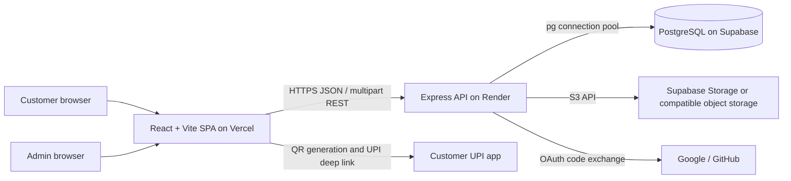

# Vaishnavi Silk Emporium

Vaishnavi Silk Emporium is a saree storefront and store-operations portal. Customers can browse catalog data, maintain a wishlist and cart, reserve stock during checkout, submit UPI payment evidence, and track order/refund status. Administrators maintain products, categories and stock, review payment proofs, process order lifecycle changes, and update store details.

This repository contains a React single-page application, an Express REST API, and a PostgreSQL persistence layer. The codebase is the behavioral source of truth; the linked documentation records implementation details and known gaps.

## Features

- Public product and category browsing, keyword search, featured products and product details.
- Customer accounts with email/mobile/username login, Google/GitHub OAuth hooks, profile settings, preferences, wishlist, recently viewed items and addresses.
- Server-persisted cart with authoritative price and inventory checks.
- Timed checkout reservations that decrement available stock, lock cart changes, and release stock on expiry or cancellation.
- Manual UPI checkout with a generated QR, UTR/reference and uploaded payment screenshot; staff review is required before fulfillment.
- Customer order tracking, cancellation and refund status; admin order, payment and refund workflows.
- Admin catalog, inventory, category, audit, report and store-settings views.
- In-app and browser notifications, including back-in-stock subscription alerts.
- English/Telugu UI labels, light/dark theme, responsive storefront and admin navigation.

## Screenshots

No screenshots are currently tracked in the repository. Add reviewed captures under `docs/images/` and link them here; avoid real customer data, payment references, credentials, or administrative PII.

## Architecture


```mermaid
flowchart LR
  Customer[Customer browser] --> Frontend[React + Vite SPA on Vercel]
  Admin[Admin browser] --> Frontend
  Frontend -->|HTTPS JSON / multipart REST| API[Express API on Render]
  API -->|pg connection pool| DB[(PostgreSQL on Supabase)]
  API -->|S3 API| Storage[Supabase Storage or compatible object storage]
  API -->|OAuth code exchange| OAuth[Google / GitHub]
  Frontend -->|QR generation and UPI deep link| UPI[Customer UPI app]
```

The Vercel/Render/Supabase topology is the deployment configuration documented by this repository (`render.yaml`, Vercel configuration and deployment notes); confirm live account settings before a production change. There is no separate CDN, custom domain, SSL certificate, or deployment workflow defined in repository configuration.

## Tech Stack

| Area | Implementation |
| --- | --- |
| Frontend | React 18, React Router 6, Vite, Axios, Framer Motion |
| Frontend services | Vercel Analytics and Speed Insights; `qrcode` for local QR rendering |
| Backend | Node.js 20+, Express 4, `pg`, PostgreSQL |
| Security and uploads | JWT, bcryptjs, express-validator, express-rate-limit, Helmet, Multer, image-size |
| Object storage | AWS S3 SDK against an S3-compatible endpoint (configured for Supabase Storage) |
| Automated tests | Node built-in test runner; focused backend unit tests |
| CI | GitHub Actions validates backend syntax and frontend production build on `main` pushes and pull requests targeting `main` |

## Repository Layout

```text
backend/                   Express API, runtime PostgreSQL schema, services, tests
  src/                     Routes, controllers, repositories and domain logic
  test/                    Node unit tests
docs/                      API collection, schema artifacts, guides and technical docs
frontend/                  React/Vite storefront and admin portal
  src/pages/               Route-level customer and admin pages
  src/components/          Shared layouts and UI components
  src/utils/               Currency, image, notification and UPI helpers
.github/workflows/ci.yml   Build validation workflow
render.yaml                Render backend Blueprint
```

## Local Setup

Prerequisites: Node.js 20 or later, npm, and a reachable PostgreSQL database. `DATABASE_URL` is mandatory; backend startup creates missing tables and applies additive compatibility updates. Use an isolated development database, not production.

1. Install and configure the API:

```bash
cd backend
npm ci
cp .env.example .env
```

Set `DATABASE_URL` to the development PostgreSQL connection string in `backend/.env`. `JWT_SECRET` should be a random value of at least 32 characters in production. Object-storage credentials are needed for image/avatar/payment-proof uploads. Review [docs/DEPLOYMENT.md](docs/DEPLOYMENT.md) for the complete variable catalog and environment requirements.

2. In one terminal, start the API. Startup initializes schema, creates configured demo accounts if missing, reconciles inventory, and listens on port 4000 by default:

```bash
cd backend
npm run dev
```

3. In another terminal, configure and start the frontend:

```bash
cd frontend
npm ci
cp .env.example .env
npm run dev
```

The Vite app is normally available at `http://localhost:5173`; the API health route is `http://localhost:4000/api/health`. Configure `VITE_API_URL` to the API's `/api` base. Configure `VITE_UPI_ID` to enable UPI QR generation. Login demo credentials are supplied by `ADMIN_USERNAME`/`ADMIN_PASSWORD` and `USER_USERNAME`/`USER_PASSWORD`; the backend creates these accounts only if those usernames do not already exist. Change the example credentials and never use them in a public environment.

## Tests and Builds

Backend tests:

```bash
cd backend
npm test
```

Frontend production build:

```bash
cd frontend
npm run build
npm run preview
```

There is no committed frontend test or E2E suite. The current CI workflow does not run `npm test`; see [docs/TESTING_STRATEGY.md](docs/TESTING_STRATEGY.md).

## Deployment

The repository describes a Vercel-hosted Vite frontend, Render-hosted Node API, Supabase PostgreSQL, and S3-compatible object storage. The Render Blueprint uses `backend/`, `npm ci`, `npm start`, and `/api/health`. Vercel uses `frontend/`, Vite, and SPA rewrites. `VITE_API_URL` and `VITE_UPI_ID` are build-time frontend values. Review [docs/DEPLOYMENT.md](docs/DEPLOYMENT.md) for the deployment topology, steps, rollback, backups and operational gaps; verify provider dashboards before treating a documented target as a live fact.

## Technical Documentation

- [System architecture](docs/ARCHITECTURE.md), [frontend architecture](docs/FRONTEND_ARCHITECTURE.md), [backend architecture](docs/BACKEND_ARCHITECTURE.md)
- [API reference](docs/API_REFERENCE.md), [database schema](docs/DATABASE_SCHEMA.md), [entity relationships](docs/ENTITY_RELATIONSHIPS.md)
- [Authentication](docs/AUTHENTICATION.md), [inventory](docs/INVENTORY_MANAGEMENT.md), [orders](docs/ORDER_MANAGEMENT.md), [payments](docs/PAYMENT_WORKFLOW.md), [notifications](docs/NOTIFICATION_SYSTEM.md)
- [Admin guide](docs/ADMIN_GUIDE.md), [user guide](docs/USER_GUIDE.md), [business rules](docs/BUSINESS_RULES.md), [data flows](docs/DATA_FLOW_DIAGRAMS.md)
- [Deployment](docs/DEPLOYMENT.md), [security review](docs/SECURITY.md), [performance analysis](docs/PERFORMANCE_ANALYSIS.md), [testing strategy](docs/TESTING_STRATEGY.md)
- [Troubleshooting](docs/TROUBLESHOOTING.md), [maintenance](docs/MAINTENANCE_GUIDE.md), [codebase analysis](docs/CODEBASE_ANALYSIS_REPORT.md), [future roadmap](docs/FUTURE_ARCHITECTURE_ROADMAP.md), [project knowledge base](docs/PROJECT_KNOWLEDGE_BASE.md)
- Existing Postman material: [API coverage](docs/api-coverage.md) and the checked-in Postman collection/environment files.

## Contributing

1. Create a focused branch from `main`; no `develop`, feature, or hotfix naming policy is currently enforced in CI.
2. Keep changes within the owning frontend, API, persistence, or documentation module and update the relevant docs when behavior changes.
3. Run `npm test` in `backend` and `npm run build` in `frontend` for changes affecting those modules. CI currently runs backend syntax validation and the frontend build only.
4. Do not commit secrets, `.env` files, real payment evidence, customer data, or generated credentials. Use a development database and sanitized fixtures.
5. Include the behavior changed, migration/configuration impact, and verification performed in the pull request.
