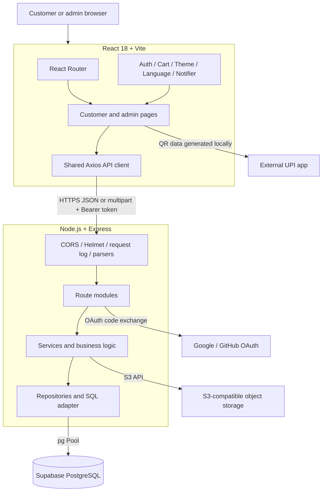
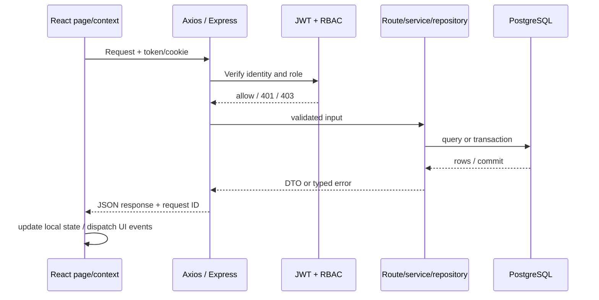

# System Architecture

## Topology

This is a browser-based storefront/admin SPA backed by one Express modular monolith and PostgreSQL. API owns identity, access control, pricing, inventory, order/payment state, notification persistence, and storage operations. Frontend owns route rendering, interaction state, and local QR rendering.

Vercel, Render and Supabase are the repository-documented target, evidenced by Vercel rewrite config, Render Blueprint and deployment guide. Provider dashboards are external and must be checked before operational use. No custom CDN/domain, Supabase infrastructure-as-code, payment gateway or message broker is in source.

## Modules and Dependencies

| Layer | Modules | Responsibility |
| --- | --- | --- |
| Composition | `server.js`, `config.js`, `middleware.js` | Express setup, config, CORS/Helmet/logging, route mounting, health and startup work. |
| Routes | `*.routes.js` | HTTP contracts, RBAC, validators, response/status mapping. |
| Controllers | `cart.controller.js`, `inventory.controller.js` | Request/response translation for cart and inventory. |
| Domain services | cart, checkout, inventory, notification, order helpers | Pricing, state transitions, stock reservation and workflow coordination. |
| Repositories | cart, order, address, inventory, reservation | PostgreSQL reads/writes and transaction boundaries. |
| Persistence | `db.js` | `pg.Pool`, SQL normalization, generated IDs, transactions, runtime DDL/backfills. |
| External adapters | `s3-storage.service.js`, OAuth in auth routes, translation service | Object storage and OAuth provider calls. Translation provider is not currently called. |

This is a modular monolith; layer boundaries are not strict and some route handlers issue SQL directly. `db.js` provides SQLite-like convenience syntax but executes PostgreSQL SQL.

## Frontend Hierarchy and State

`main.jsx` provider order is BrowserRouter → AuthProvider → ThemeProvider → LanguageProvider → CartProvider → NotifierProvider → App. `PublicLayout` renders Header/Outlet/Footer; `AdminLayout` renders dedicated admin header/navigation/Outlet. Shared client is Axios with credentials, Bearer injection, one refresh-and-retry on protected 401, and auth storage helpers. Vercel Analytics and Speed Insights load from App.

- PostgreSQL owns users, catalog, inventory, cart, addresses, reservations, orders, wishlists, notifications and settings.
- Contexts own active auth/session, cart snapshot, theme, language and modal notification queue.
- Browser storage holds access token/user snapshot (session or local storage), preferences, recently viewed data and checkout reservation/QR cache.
- Route components own most query/form/loading state. There is no global query cache or Redux-like store.

## Request and Event Flow

1. Axios sends request with Bearer access token where available; refresh requests use HttpOnly cookie.
2. Express assigns/echoes `x-request-id`, logs finish, applies CORS/Helmet/body parsing, then dispatches route.
3. Route middleware checks JWT/role and selected express-validator rules.
4. Service/repository queries or mutates PostgreSQL; checkout/order critical paths use transactions and row locks.
5. JSON response updates page/context state. Notification browser events trigger header/order-detail refresh; database notifications are polled, not pushed.

## Ownership Boundaries

- `Inventory` is authoritative; `Products.Quantity` mirrors physical `CurrentStock`. Sellable quantity is `AvailableStock`; active reservations move quantity from available to reserved.
- Prices and quantities are server-computed and snapshotted in reservation/order items. QR is generated in browser from reservation snapshot and `VITE_UPI_ID`.
- Order status, payment review status, and refund status are distinct fields. Verification starts fulfillment; admins drive later fulfillment.
- Images upload via Multer memory buffers to configured S3-compatible storage; DB stores public URLs. Storage config is not checked at startup.
- Notifications are persisted DB rows; browser polling/audio is not server push.

## Schema and Constraints

Runtime schema is created/updated by `backend/src/db.js` at startup. `docs/schema.sql` is a partial legacy SQLite file and `docs/supabase-schema.sql` is an incomplete earlier PostgreSQL draft; see [DATABASE_SCHEMA.md](DATABASE_SCHEMA.md). There is no API version prefix/OpenAPI spec, ordered migration history, general API rate limiter, WebSocket/SSE, or DB integration/E2E test suite. See [DEPLOYMENT.md](DEPLOYMENT.md) for rollout risks.
