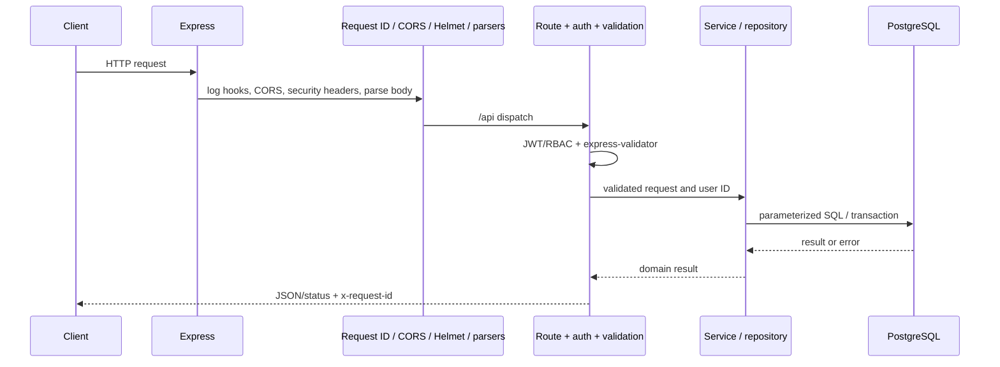
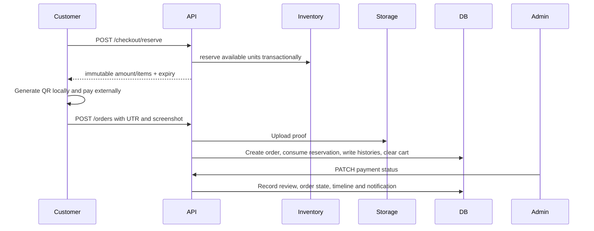

# Backend Architecture

## Startup and Request Lifecycle

`server.js` composes Express. Importing `db.js` requires `DATABASE_URL`, connects using `pg.Pool`, creates runtime tables, applies additive ALTER/backfills and checks required schema. Server startup creates configured admin/customer only if usernames are absent, initializes/reconciles Inventory, inserts default categories/settings, starts reservation cleanup immediately and every 30 seconds, then listens on `PORT` (default 4000).

Middleware order: request ID/completion logger, CORS with credentials, OPTIONS, Helmet, JSON parser (1 MB), URL-encoded parser, routes, centralized error handler. Multer memory storage is installed at upload routes; maximum file size 5 MB.

## Modules

| Group | Modules and purpose |
| --- | --- |
| Composition/config | `server.js`, `config.js`, `middleware.js`: app setup, CORS, health, startup and cleanup. |
| Auth/admin users | `auth.routes.js`, `admin-users.routes.js`: registration/login/refresh/logout, OAuth, profile/password/avatar, ADMIN user management. |
| Catalog | `products.routes.js`, `categories.routes.js`, `product-images.js`, `product-audit.js`. |
| Inventory | `inventory.routes.js`, controller/service/repository, `inventory-logic.js`. |
| Cart/checkout | `cart.routes.js`, controller/service/repository, `checkout.routes.js`, `checkout.service.js`, `reservation.repository.js`. |
| Orders/payments | `orders.routes.js`, `admin-orders.routes.js`, `order.repository.js`, `order-pricing.js`, `payment-review.js`, `order-reference.js`. |
| Customer services | `address.routes.js`/repository, wishlists, notifications/service, translations/service, store settings. |
| Persistence/storage | `db.js` pg adapter/transactions/runtime schema; `s3-storage.service.js` S3-compatible objects. |

The backend is a modular monolith, not strict layered architecture: some handlers issue SQL directly. No DI container or generated OpenAPI router exists.

## Authentication and Authorization

Access JWT includes user ID/username/role and expires in 15 minutes. `authRequired` verifies Bearer token; `optionalAuth` ignores invalid/missing token; `adminOnly` requires ADMIN. Cart/checkout/addresses/orders require USER. Wishlist and notification endpoints require any authenticated role; private queries scope by user ID. Registration/OAuth creates USER only.

Refresh JWT is backed by `RefreshSessions` and an HttpOnly `refresh_session` cookie at `/api/auth`, rotated on refresh. Production cookie is Secure/SameSite=None; development SameSite=Lax. Login/register limit is 20 requests per 15 minutes. No general API limiter.

## Validation, Error Handling, Logging

Selected routes use express-validator; `validateRequest` returns 400 and field errors. Coverage is inconsistent. JSON is capped at 1 MB. Upload MIME types are JPG/PNG/WEBP, 5 MB each; avatar additionally must decode to at least 100x100. Central `errorHandler` maps common PostgreSQL codes, upload limits and typed status errors to JSON with request ID/diagnostic code. Some route/service logging includes payload/query information; payment reference is masked in central errors but redaction is not uniform. Logs go to stdout/stderr; no external error collector is configured.

## Persistence and Transactions

`db.js` wraps `pg.Pool`, converts `?` placeholders, quotes known CamelCase identifiers, appends `RETURNING` for known generated IDs and exposes BEGIN/COMMIT/ROLLBACK transaction callbacks. `FOR UPDATE` is used for stock/cart/reservation concurrency and `SKIP LOCKED` for expiration cleanup. Order/reservation/cancel/refund and address-default paths use transactions.

DDL lives in startup code (`CREATE TABLE IF NOT EXISTS`, additive ALTERs and backfills), not ordered migrations. `InventoryMigrations` only marks legacy stock bootstrap. Multiple running versions can encounter schema/rollout compatibility risk.

## Uploads and Images

Multer buffers files in memory. Products accept one `image` plus up to eight `images`; update checks combined count <=8, create does not. Avatars and payment proofs accept one file. `s3-storage.service.js` uploads UUID keys under `products/`, `avatars/`, `payment-proofs/` using AWS SDK against S3-compatible endpoint and returns public URL. Superseded-object deletion is best-effort; no local upload/static route is mounted. Storage environment is not startup-validated; DB failure after upload can orphan objects. MIME metadata is checked; all files are not decoded/scanned.

## Order and Payment Sequence

The API does not verify UPI automatically. Payment begins PENDING. VERIFIED advances an eligible order to PROCESSING; REJECTED on reservation order cancels/restores stock. Resubmission is available only for rejected, non-cancelled order.

## Third Parties and Failure Modes

OAuth exchanges use Node fetch to Google/GitHub. S3 uses AWS SDK. QR rendering and Vercel telemetry are frontend-side. No gateway, email sender, queue, websocket, translation inference call, or general background worker exists. Reservation cleanup is process-local; expired reservations are also released lazily by request paths. Admin order search loads all rows and filters in application memory. Missing DB/schema prevents startup/health.
