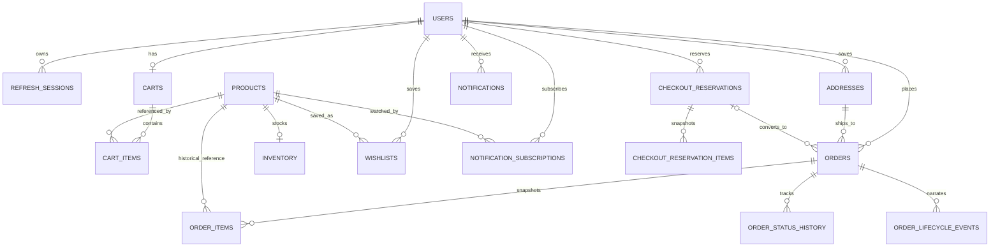

# Database Schema

## Source of Truth

The runtime schema is `backend/src/db.js`, using PostgreSQL through `pg.Pool` and quoted CamelCase identifiers. Startup performs `CREATE TABLE IF NOT EXISTS`, additive `ALTER TABLE`, backfills, and required-schema checks. `docs/schema.sql` is a partial legacy SQLite schema; `docs/supabase-schema.sql` is an older/incomplete PostgreSQL draft with different names/types and fewer tables. Neither is a safe replacement for the runtime schema. IDs may be returned by `pg` as strings; application code often coerces to numbers.

## Tables and Columns

| Table | Purpose; runtime columns, types, and constraints |
| --- | --- |
| `Users` | Identity/profile. `UserId` BIGINT identity PK; `Username` TEXT UNIQUE NOT NULL; `PasswordHash` TEXT NOT NULL; `Role` TEXT NOT NULL CHECK `ADMIN|USER`; `FullName`,`DisplayName` TEXT NOT NULL DEFAULT `''`; `Email` TEXT UNIQUE; `AvatarUrl` TEXT; `MobileNumber` TEXT NOT NULL DEFAULT `''`; `Preferences` TEXT NOT NULL DEFAULT `'{}'` (serialized JSON text); `CreatedDate` TIMESTAMPTZ DEFAULT now; `LastLogin` TIMESTAMPTZ; `OAuthProvider`,`OAuthSubject` TEXT; `IsEnabled` INTEGER DEFAULT 1 CHECK 0/1; UNIQUE `(OAuthProvider,OAuthSubject)`. |
| `RefreshSessions` | Revocable refresh allowlist. `SessionId` UUID PK; `UserId` BIGINT FK Users ON DELETE CASCADE; `ExpiresAt` TIMESTAMPTZ NOT NULL; `CreatedDate` TIMESTAMPTZ DEFAULT now. |
| `Categories` | Category/filter lookup. `CategoryId` BIGINT identity PK; `CategoryName` TEXT UNIQUE NOT NULL; `Description` TEXT NOT NULL DEFAULT `''`; `IsActive` INTEGER DEFAULT 1 CHECK 0/1; `CreatedDate`,`UpdatedDate` TIMESTAMPTZ DEFAULT now. |
| `Products` | Catalog and price. `ProductId` BIGINT identity PK; `ProductName`,`Description`,`Category` TEXT NOT NULL (`Category` is not an FK); `Price` NUMERIC(12,2) NOT NULL CHECK >=0; `DiscountedPrice` NUMERIC(12,2) nullable CHECK null or 0..Price; `ImageUrl` TEXT (JSON array string or legacy URL); `Quantity` INTEGER DEFAULT 0 CHECK >=0 (compatibility mirror); `IsActive`,`IsFeatured` INTEGER DEFAULT 0 CHECK 0/1; `Fabric`,`WeavingStyle`,`Colour`,`Occasion` TEXT NOT NULL DEFAULT `''`; `SareeLength` TEXT DEFAULT `5.5 metres`; `BlousePieceIncluded` INTEGER DEFAULT 1 CHECK 0/1; `CareInstructions` TEXT DEFAULT `''`; `Rating` NUMERIC(2,1) DEFAULT 4.5 CHECK 0..5; `CreatedDate`,`UpdatedDate` TIMESTAMPTZ DEFAULT now. |
| `Inventory` | Authoritative stock. `InventoryId` BIGINT identity PK; `ProductId` BIGINT UNIQUE NOT NULL FK Products CASCADE; `CurrentStock`,`AvailableStock`,`ReservedStock` INTEGER DEFAULT 0 each CHECK >=0; `Status` TEXT CHECK `IN_STOCK|LOW_STOCK|OUT_OF_STOCK`; timestamps; CHECK `AvailableStock + ReservedStock = CurrentStock`. |
| `InventoryMigrations` | One-time bootstrap marker. `MigrationKey` TEXT PK; `AppliedAt` TIMESTAMPTZ DEFAULT now. |
| `InventoryAuditLog` | Inventory view/update history. `AuditId` BIGINT identity PK; `InventoryId` BIGINT FK Inventory CASCADE; `ProductId` BIGINT FK Products CASCADE; `AdminUserId` BIGINT FK Users SET NULL; `Action` TEXT CHECK `VIEWED|UPDATED|RESTOCKED|STATUS_CHANGED`; nullable `OldStock`,`NewStock` INTEGER; `CreatedDate` TIMESTAMPTZ DEFAULT now. |
| `ProductAuditLog` | Product changes. `AuditId` BIGINT identity PK; `ProductId` BIGINT NOT NULL (no FK); `UserId` BIGINT FK Users SET NULL; `Action` TEXT CHECK `CREATED|UPDATED|DELETED|ARCHIVED|RESTORED|VISIBILITY_CHANGED|INVENTORY_CHANGED`; `OldValues`,`NewValues` TEXT (serialized JSON); `CreatedDate` TIMESTAMPTZ DEFAULT now. |
| `Carts` | One cart per user. `CartId` BIGINT identity PK; `UserId` BIGINT UNIQUE NOT NULL FK Users CASCADE; `CreatedDate`,`UpdatedDate` TIMESTAMPTZ DEFAULT now. |
| `CartItems` | Current cart lines. `CartItemId` BIGINT identity PK; `CartId` BIGINT NOT NULL FK Carts CASCADE; `ProductId` BIGINT NOT NULL FK Products CASCADE; `Quantity` INTEGER CHECK >0; `UnitPrice` NUMERIC(12,2) CHECK >=0; timestamps; UNIQUE `(CartId,ProductId)`. Current prices are joined from Products. |
| `CartAuditLog` | Cart mutations. `AuditId` BIGINT identity PK; `CartId` BIGINT FK Carts CASCADE; `CartItemId` nullable FK CartItems SET NULL; `UserId` BIGINT FK Users CASCADE; `ProductId` nullable FK Products SET NULL; `Action` TEXT CHECK `ADDED|REMOVED|QUANTITY_UPDATED|CLEARED`; `OldQuantity`,`NewQuantity` INTEGER; `CreatedDate` default now. |
| `Addresses` | Customer delivery locations. `AddressId` BIGINT identity PK; `UserId` BIGINT NOT NULL FK Users CASCADE; `FullName`,`MobileNumber`,`AddressLine1`,`City`,`State`,`PostalCode` TEXT NOT NULL; `AddressLine2` TEXT DEFAULT `''`; `Country` TEXT DEFAULT `India`; `IsDefault` INTEGER DEFAULT 0 CHECK 0/1; `CreatedDate`,`UpdatedDate` TIMESTAMPTZ DEFAULT now. No unique constraint enforces one default. |
| `CheckoutReservations` | Timed holds. `ReservationId` UUID PK; `UserId` BIGINT NOT NULL FK Users CASCADE; `AddressId` nullable FK Addresses SET NULL; `ReservationSessionId` TEXT NOT NULL; `ReservationStatus` TEXT CHECK `ACTIVE|EXPIRED|CONVERTED_TO_ORDER|RELEASED`; `ReservedAt`,`ExpiresAt`,`UpdatedDate` TIMESTAMPTZ; UNIQUE `(UserId,ReservationSessionId)`. |
| `CheckoutReservationItems` | Immutable checkout snapshot. `ReservationItemId` BIGINT identity PK; `ReservationId` UUID NOT NULL FK CheckoutReservations CASCADE; `ProductId` BIGINT NOT NULL FK Products RESTRICT; `ProductName` TEXT NOT NULL; `UnitPrice`,`OriginalPrice` NUMERIC(12,2) CHECK >=0 (`OriginalPrice` additive migration); `Quantity` INTEGER >0; `CreatedDate` default now; UNIQUE `(ReservationId,ProductId)`. |
| `Orders` | Order/payment/refund aggregate. `OrderId` BIGINT identity PK; `UserId` BIGINT NOT NULL FK Users; `AddressId` BIGINT NOT NULL FK Addresses; `DeliveryMobileNumber` TEXT NOT NULL DEFAULT `''` (order-time snapshot of address contact); `OrderNumber` TEXT UNIQUE NOT NULL; `IdempotencyKey` TEXT; `ReservationId` UUID nullable FK CheckoutReservations SET NULL; `PaymentMethod` TEXT DEFAULT `COD`; `PaymentReference` TEXT; `PaymentScreenshotKey` TEXT nullable (private-bucket object key); `PaymentScreenshotUrl` TEXT nullable legacy field, cleared by migration; `PaymentStatus` TEXT DEFAULT `PENDING` (no CHECK); `PaymentSubmittedAt`,`PaymentReviewedAt` TIMESTAMPTZ; `PaymentRejectionReason` TEXT; `OrderStatus` TEXT DEFAULT `PENDING` CHECK `PENDING|PROCESSING|PACKED|SHIPPED|OUT_FOR_DELIVERY|DELIVERED|CANCELLED|REFUNDED`; `SubTotal`,`ShippingAmount`,`DiscountAmount`,`GrandTotal` NUMERIC(12,2) CHECK >=0; `CancelledAt` TIMESTAMPTZ; `CancellationReason` TEXT; `CancelledByRole` TEXT CHECK null or `CUSTOMER|ADMIN`; `RefundStatus` TEXT DEFAULT `NOT_APPLICABLE` CHECK `NOT_APPLICABLE|PENDING|PROCESSING|COMPLETED|FAILED`; `RefundReference` TEXT; `RefundInitiatedAt`,`RefundProcessingAt`,`RefundCompletedAt` TIMESTAMPTZ; `CreatedDate`,`UpdatedDate` TIMESTAMPTZ; UNIQUE `(UserId,IdempotencyKey)`. Payment/reservation/contact columns are partly added by startup ALTERs. Existing orders have empty contact snapshot; admin UI falls back to stored address mobile. |
| `OrderItems` | Historical item/price snapshots. `OrderItemId` BIGINT identity PK; `OrderId` BIGINT NOT NULL FK Orders CASCADE; `ProductId` nullable FK Products SET NULL; `ProductName` TEXT NOT NULL; `ProductPrice`,`OriginalPrice`,`DiscountedPrice`,`SavingsAmount`,`LineTotal` NUMERIC(12,2) CHECK >=0; `DiscountPercentage` NUMERIC(5,2) CHECK >=0; `ImageUrl` TEXT; `Quantity` INTEGER >0; `CreatedDate` default now. Several pricing/image columns are additive startup migrations. |
| `OrderAuditLog` | Order actions. `AuditId` BIGINT identity PK; `OrderId` nullable FK Orders CASCADE; `UserId` nullable FK Users SET NULL; `Action` TEXT CHECK `ORDER_CREATED|ORDER_UPDATED|ORDER_CANCELLED|INVENTORY_DEDUCTED|ADDRESS_ADDED`; `CreatedDate` default now. |
| `OrderStatusHistory` | Status changes. `StatusHistoryId` BIGINT identity PK; `OrderId` BIGINT NOT NULL FK Orders CASCADE; `OldStatus` TEXT; `NewStatus` TEXT NOT NULL; `ChangedBy` BIGINT FK Users SET NULL; `ChangedAt` TIMESTAMPTZ default now. |
| `OrderLifecycleEvents` | User-visible timeline. `LifecycleEventId` BIGINT identity PK; `OrderId` BIGINT NOT NULL FK Orders CASCADE; `EventType`,`Title` TEXT NOT NULL; `Description` TEXT DEFAULT `''`; `ActorRole` TEXT CHECK null or `CUSTOMER|ADMIN|SYSTEM`; `ChangedBy` BIGINT FK Users SET NULL; `EventDate` TIMESTAMPTZ default now. |
| `Wishlists` | Saved product relation. `WishlistId` BIGINT identity PK; `UserId` BIGINT FK Users CASCADE; `ProductId` BIGINT FK Products CASCADE; `CreatedDate` default now; UNIQUE `(UserId,ProductId)`. |
| `NotificationSubscriptions` | One-shot back-in-stock watch. `SubscriptionId` BIGINT identity PK; `UserId` BIGINT FK Users CASCADE; `ProductId` BIGINT FK Products CASCADE; `NotificationType` TEXT DEFAULT `BACK_IN_STOCK`; `CreatedDate` default now; `IsActive`,`IsSent` INTEGER default 1/0 CHECK 0/1; `SentDate` TIMESTAMPTZ; UNIQUE `(UserId,ProductId,NotificationType)`. |
| `Notifications` | In-app messages. `NotificationId` BIGINT identity PK; `UserId` BIGINT FK Users CASCADE; `ProductId` nullable FK Products SET NULL; `OrderId` BIGINT nullable (no FK); `Type`,`Title`,`Message` TEXT NOT NULL; `IsRead` INTEGER default 0 CHECK 0/1; `ReadDate` TIMESTAMPTZ; `CreatedDate` default now. |
| `TranslationCache` | Cached translations. `CacheKey` TEXT PK; `SourceLanguage`,`TargetLanguage`,`SourceText`,`TranslatedText`,`Provider` TEXT NOT NULL; `CreatedDate` default now. |
| `StoreSettings` | Singleton store config. `SettingsId` INTEGER PK CHECK =1; `StoreName`,`Email` TEXT NOT NULL; `Tagline`,`Phone`,`Address`,`BusinessDescription` TEXT default `''`; `UpdatedDate` TIMESTAMPTZ default now; `UpdatedBy` BIGINT FK Users. |

## Example Data

All values below are synthetic examples; credentials, contact details, references and IDs are not production data.

| Table | Example row |
| --- | --- |
| `Users` | `{UserId:1,Username:"customer@example.test",Role:"USER",FullName:"Sample Customer",IsEnabled:1}` |
| `RefreshSessions` | `{SessionId:"11111111-1111-4111-8111-111111111111",UserId:1,ExpiresAt:"2030-01-01T00:00:00Z"}` |
| `Categories` | `{CategoryId:2,CategoryName:"Silk Sarees",IsActive:1}` |
| `Products` | `{ProductId:42,ProductName:"Sample Silk Saree",Category:"Silk Sarees",Price:12000,DiscountedPrice:10500,Quantity:7,IsActive:1}` |
| `Inventory` | `{InventoryId:42,ProductId:42,CurrentStock:7,AvailableStock:5,ReservedStock:2,Status:"LOW_STOCK"}` |
| `InventoryMigrations` | `{MigrationKey:"inventory-from-legacy-product-quantity-v1",AppliedAt:"2026-01-01T00:00:00Z"}` |
| `InventoryAuditLog` | `{AuditId:8,ProductId:42,Action:"RESTOCKED",OldStock:5,NewStock:7,AdminUserId:3}` |
| `ProductAuditLog` | `{AuditId:9,ProductId:42,Action:"UPDATED",UserId:3,OldValues:"{...}",NewValues:"{...}"}` |
| `Carts` | `{CartId:7,UserId:1,UpdatedDate:"2026-01-01T00:00:00Z"}` |
| `CartItems` | `{CartItemId:11,CartId:7,ProductId:42,Quantity:1,UnitPrice:10500}` |
| `CartAuditLog` | `{AuditId:12,CartId:7,UserId:1,ProductId:42,Action:"ADDED",NewQuantity:1}` |
| `Addresses` | `{AddressId:4,UserId:1,FullName:"Sample Customer",City:"Hyderabad",Country:"India",IsDefault:1}` |
| `CheckoutReservations` | `{ReservationId:"22222222-2222-4222-8222-222222222222",UserId:1,ReservationStatus:"ACTIVE",ExpiresAt:"2030-01-01T00:05:00Z"}` |
| `CheckoutReservationItems` | `{ReservationItemId:13,ReservationId:"22222222-2222-4222-8222-222222222222",ProductId:42,UnitPrice:10500,Quantity:1}` |
| `Orders` | `{OrderId:15,UserId:1,AddressId:4,OrderNumber:"VSE-ABCD1234",PaymentMethod:"UPI_MANUAL",PaymentStatus:"PENDING",OrderStatus:"PENDING",GrandTotal:10500}` |
| `OrderItems` | `{OrderItemId:16,OrderId:15,ProductId:42,ProductName:"Sample Silk Saree",ProductPrice:10500,Quantity:1,LineTotal:10500}` |
| `OrderAuditLog` | `{AuditId:17,OrderId:15,UserId:1,Action:"ORDER_CREATED"}` |
| `OrderStatusHistory` | `{StatusHistoryId:18,OrderId:15,OldStatus:null,NewStatus:"PENDING",ChangedBy:1}` |
| `OrderLifecycleEvents` | `{LifecycleEventId:19,OrderId:15,EventType:"ORDER_PLACED",Title:"Order Placed",ActorRole:"CUSTOMER"}` |
| `Wishlists` | `{WishlistId:20,UserId:1,ProductId:42}` |
| `NotificationSubscriptions` | `{SubscriptionId:21,UserId:1,ProductId:42,NotificationType:"BACK_IN_STOCK",IsActive:1,IsSent:0}` |
| `Notifications` | `{NotificationId:22,UserId:1,ProductId:42,Type:"BACK_IN_STOCK",IsRead:0}` |
| `TranslationCache` | `{CacheKey:"<sha256>",SourceLanguage:"en",TargetLanguage:"te",Provider:"identity-fallback"}` |
| `StoreSettings` | `{SettingsId:1,StoreName:"Vaishnavi Silk Emporium",Email:"care@example.test"}` |

## Relationships

The diagram includes logical ownership. `Notifications.OrderId` and `ProductAuditLog.ProductId` have no FK. The database does not enforce that an order's AddressId belongs to the same UserId; checkout code validates it. `Products.Category` is text and category rename updates strings.

## Indexes

Explicit runtime indexes: `idx_products_active(IsActive)`, `idx_products_category(Category)`, `idx_products_name(ProductName)`, `idx_refresh_sessions_user(UserId)`, `idx_notification_subscriptions_product(ProductId,IsSent)`, `idx_notifications_user(UserId,IsRead,CreatedDate)`, `idx_wishlists_user(UserId,CreatedDate)`, `idx_categories_active(IsActive)`, `idx_products_featured(IsFeatured)`, `idx_inventory_status(Status)`, `idx_inventory_audit_product(ProductId,CreatedDate)`, `idx_product_audit_product(ProductId,CreatedDate)`, `idx_cart_items_cart(CartId)`, `idx_cart_audit_user(UserId,CreatedDate)`, `idx_orders_user(UserId,CreatedDate)`, `idx_order_items_order(OrderId)`, `idx_order_status_history_order(OrderId,ChangedAt)`, `idx_order_lifecycle_events_order(OrderId,EventDate)`. Primary/unique constraints create their own indexes.

## Example Rows and Invariants

Inventory example: `{ProductId:42,CurrentStock:7,ReservedStock:2,AvailableStock:5,Status:"LOW_STOCK"}`. A reserved payment session stores line item name/price/quantity in `CheckoutReservationItems`; an order copies values into `OrderItems` so history does not depend on current product pricing.

Key invariants: `AvailableStock + ReservedStock = CurrentStock`; all stock counts are non-negative; one cart per user; one item per product per cart; one wishlist entry per user/product; reservation session unique per user; order idempotency key unique per user. `IsDefault` address uniqueness is enforced by transaction logic, not a DB constraint. Inventory `Status` is constrained but application-maintained.

## Schema Risks

- Startup DDL is not a versioned migration workflow. Rolling app versions can race on schema changes; take a backup and test additive migrations against a clone.
- The checked-in SQL files are not equivalent to runtime DDL. Applying the snake_case Supabase draft to this CamelCase runtime schema is unsafe.
- Several implied relationships have no FK/check constraints, and payment status has no DB CHECK.
- Admin order filtering is unpaginated and performed in application memory.
