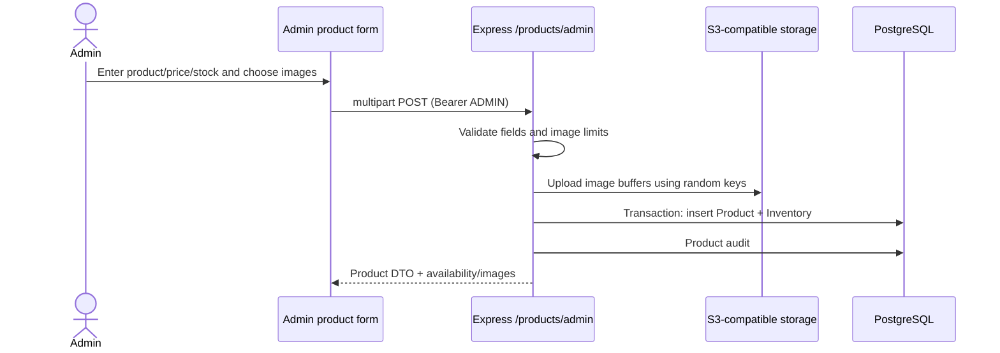
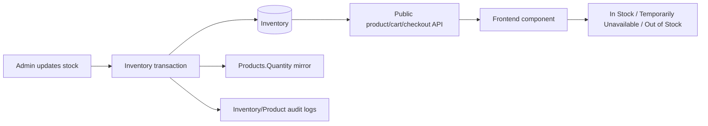
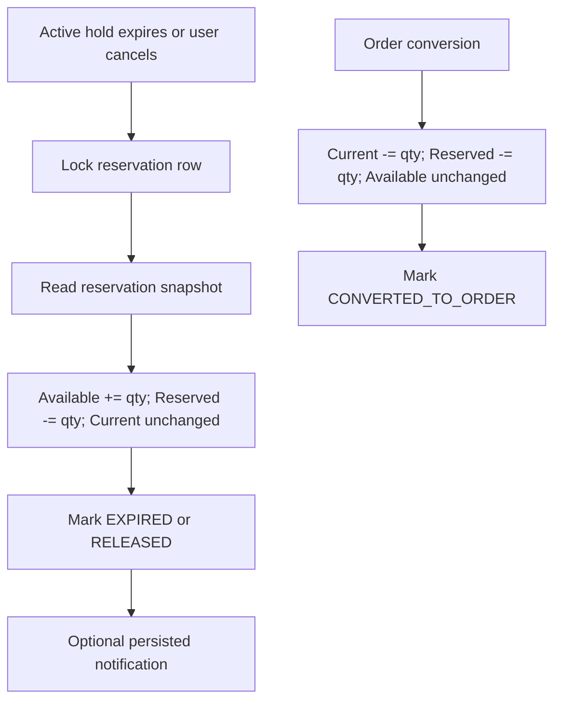
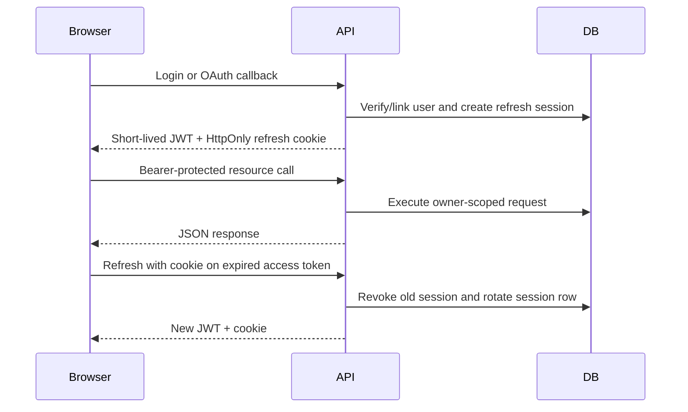

# Data Flow Diagrams

## Product Creation and Images



If the database transaction fails after successful image upload, the create route does not consistently compensate/delete those uploaded objects; identify potential orphan keys during recovery.

## Catalog and Stock Read



## Cart to Order and Payment

```mermaid
sequenceDiagram
  actor Customer
  participant UI
  participant API
  participant DB
  participant UPI as External UPI app
  participant Admin
  Customer->>UI: Add products, choose address
  UI->>API: Cart reads/mutations
  API->>DB: Verify active product and AvailableStock
  Customer->>UI: Begin checkout
  UI->>API: POST /checkout/reserve
  API->>DB: Lock cart; Available -= qty; Reserved += qty; snapshot
  API-->>UI: Reservation + expiry + locked prices
  UI->>UPI: Locally rendered QR URI (customer scans/pays)
  Customer->>UI: Enter UTR and select screenshot
  UI->>API: POST /orders with idempotency/reservation headers
  API->>DB: Atomic order creation; Current -= qty; Reserved -= qty; clear cart
  Admin->>API: Review payment status
  API->>DB: Persist verified/rejected state, timeline and notification
```

## Reservation Release / Expiration



## Notifications

```mermaid
flowchart LR
  Event[Order/payment/refund/stock event] --> Service[notification.service.js]
  Service --> DB[(Notifications table)]
  DB --> Poll[Header polls every 5 seconds]
  DB --> Center[Notification center fetches latest 50]
  Poll --> Bell[Unread count / browser notification]
  Center --> Read[Mark read or delete read item]
  Read --> Changed[notifications:changed browser event]
  Changed --> Refetch[Header/order detail refresh]
  Center -->|orderId| OrderPage[/orders/:id]
  Center -->|productId| ProductPage[/products/:id]
```

## Authentication



## Data Ownership Summary

Product details/images reside in Products plus external object storage. Inventory resides in Inventory. Current cart resides in Carts/CartItems. Checkout snapshot and active holds reside in CheckoutReservations/Items. Purchase truth and historical line details reside in Orders/OrderItems. Notification message/read state resides in Notifications; browser poll state is transient. See [ENTITY_RELATIONSHIPS.md](ENTITY_RELATIONSHIPS.md) and [DATABASE_SCHEMA.md](DATABASE_SCHEMA.md).
