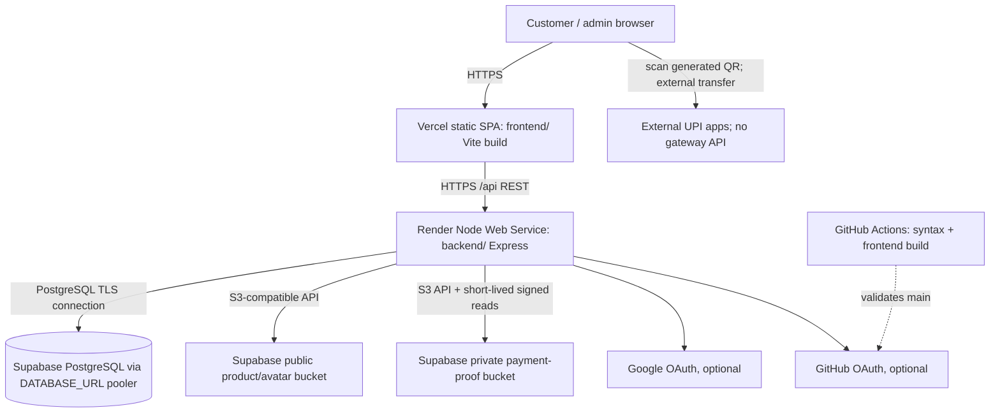
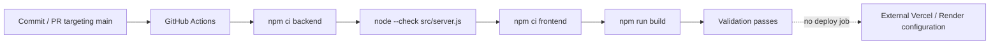

# Deployment and Operations

## Current Topology

Evidence in repo: `render.yaml` defines Render Node service rooted at `backend`; `frontend/vercel.json` rewrites SPA routes; frontend defaults to `https://vaishnavi-silk-emporium.onrender.com/api`; existing deployment configuration names Vercel, Render and Supabase. This establishes intended/configured topology, not current provider account health. Verify deployed service names, plan, domains, regions, branch connections, bucket policy, SSL, backups and current environment values in provider dashboards.

| Concern | Current evidence and boundary |
| --- | --- |
| Frontend hosting | Vercel target, root `frontend`, Vite static build; SPA rewrite sends deep links to `/index.html`. |
| Backend hosting | Render Blueprint web service `vaishnavi-silk-emporium-api`, root `backend`, `npm ci`, `npm start`, health `/api/health`. |
| Database | Supabase PostgreSQL via `pg.Pool` and `DATABASE_URL`; pooler URL is documented. Runtime schema is app-created. |
| File storage | AWS S3 SDK against configurable S3-compatible endpoint, intended Supabase Storage. Product/avatar images use `S3_BUCKET`; proofs use a distinct private `S3_PAYMENT_PROOFS_BUCKET` and admin-only five-minute signed reads. No local upload serving is mounted. |
| CDN | No custom CDN config. Vercel/object-provider delivery is platform-level; no separate CDN is configured in repository. |
| Domain/SSL | No custom domain/certificate definitions. Use provider-managed HTTPS and update exact allowed origins/provider callbacks. Verify DNS/TLS in dashboards. |
| CI/CD | GitHub Actions validates `main` pushes and PRs to `main`; deploy jobs are absent. Vercel/Render Git-based auto deploy may be enabled externally but cannot be proven from repo. |
| Stage/UAT | Postman UAT/Production environment files exist, but no distinct staging infrastructure, branch mapping, or workflow is configured in repository. |

## Environments

### Development

Use Node.js 20+, npm, and an isolated PostgreSQL database. Copy `backend/.env.example` and `frontend/.env.example`; set `DATABASE_URL`, local origins, `VITE_API_URL=http://localhost:4000/api`, and a test `VITE_UPI_ID` only if checking QR generation. Backend defaults to port 4000; Vite normally uses 5173. Startup creates configured demo users if absent, default categories/settings, tables and inventory reconciliation. `npm run seed` also inserts fixtures and must not be run against production.

### Staging/UAT

No staging service or deployment map is defined. Recommended setup: separate Render service, Supabase project/database and storage bucket, Vercel Preview/alternate project, distinct strong secrets, provider OAuth callback URIs, test-only UPI ID, and sanitized/test data. Never point staging to production DB or bucket. Postman UAT environment is client configuration only; it does not create infrastructure.

### Production

Set backend environment and frontend build-time values, connect hosting to approved Git repository/branch, verify DB schema bootstrap against a backup/clone, then test `/api/health` and controlled end-to-end workflows. `NODE_ENV=production` enables secure refresh cookie, PostgreSQL SSL option and validates required S3 credentials plus distinct bucket names. The app cannot verify bucket ACLs; confirm the proof bucket is private in Supabase.

## Environment Variables

Values are intentionally omitted. Store secrets in Render/Vercel/Supabase secret settings, not source or Postman exports.

| Variable | Purpose | Required? | Runtime/environment |
| --- | --- | --- | --- |
| `DATABASE_URL` | PostgreSQL connection string; backend throws at import if absent. Use Supabase pooler in hosted runtime. | Required | Backend dev/stage/prod |
| `JWT_SECRET` | Signs access, refresh and OAuth state JWTs. Production requires >=32 chars. | Required in production; dev fallback is insecure | Backend all |
| `NODE_ENV` | Selects production behavior, secure cookies and DB TLS options. | Optional; set `production` in production | Backend |
| `PORT` | HTTP listen port; defaults 4000; Render Blueprint sets 10000. | Optional/platform | Backend |
| `CLIENT_ORIGIN` | Comma-separated allowed frontend origins for credentialed CORS and OAuth fallback. | Required operationally in hosted env | Backend |
| `VERCEL_PROJECT_SLUG` | Allows matching Vercel preview origins. | Optional | Backend when previews are used |
| `PUBLIC_API_ORIGIN` | Public API origin for OAuth callback URL generation. | Required for OAuth; otherwise optional | Backend |
| `CHECKOUT_RESERVATION_MINUTES` | Reservation hold duration; default 5, minimum 1. | Optional | Backend |
| `ADMIN_USERNAME`, `ADMIN_PASSWORD` | Startup-created ADMIN if username is absent; existing credentials are not overwritten. | Explicitly required in production by config guard | Backend |
| `USER_USERNAME`, `USER_PASSWORD` | Startup-created USER/demo account if username is absent. Required by current production config guard. | Required in production by code | Backend |
| `GOOGLE_CLIENT_ID`, `GOOGLE_CLIENT_SECRET` | Google OAuth app credentials; both required to enable provider. | Optional | Backend |
| `GITHUB_CLIENT_ID`, `GITHUB_CLIENT_SECRET` | GitHub OAuth app credentials; both required to enable provider. | Optional | Backend |
| `S3_ENDPOINT` | S3-compatible API endpoint, typically Supabase Storage `/storage/v1/s3`. | Required for uploads; all S3 settings are startup-validated in production | Backend |
| `S3_REGION` | S3 client region. | Required for storage client | Backend |
| `S3_ACCESS_KEY`, `S3_SECRET_KEY` | S3 API credentials. | Required for storage client; secrets | Backend |
| `S3_BUCKET` | Bucket for public product/avatar media. Do not use for payment proofs. | Required in production | Backend |
| `S3_PAYMENT_PROOFS_BUCKET` | Dedicated private bucket for payment screenshots; must differ from `S3_BUCKET`. Production startup rejects missing/shared bucket names. Set bucket policy to deny anonymous reads. | Required in production | Backend |
| `VITE_API_URL` | Frontend API base; `/api` suffix normalized. | Optional due code default; set per environment | Frontend build-time |
| `VITE_UPI_ID` | Payee ID used to create UPI QR. | Required for checkout QR; public build-time config | Frontend build-time |
| `INDIC_TRANS2_URL` | Current code only changes the cached provider label; it does not call this URL. | No operational effect now | Backend if set |

`render.yaml` declares S3 settings and leaves endpoint, credentials, and bucket names for dashboard configuration; it still omits `CHECKOUT_RESERVATION_MINUTES`. Set the private bucket name there and verify its ACL separately in Supabase. `frontend/.env.example` documents `VITE_API_URL` and `VITE_UPI_ID`. `VITE_*` values are public build config, never secrets. `NEXT_PUBLIC_API_URL` is not used by this Vite app.

## Build and CI Flow

Commands:

- Backend: `npm ci`, `npm start` or `npm run dev`; tests `npm test`.
- Frontend: `npm ci`, `npm run build`, `npm run preview` or `npm run dev`.
- Backend has no transpile/build step.

CI pins Node 20, installs from lockfiles, syntax-checks only `server.js`, and builds frontend. It does not run `npm test`, migration checks, lint, vulnerability scan, browser test or deploy. A PR to `main` and push to `main` trigger validation. No deploy workflow exists in `.github/workflows`.

## Deployment Procedure

1. Confirm approval, intended commit, green CI, and target environment. Compare live provider configuration to this guide.
2. Back up database and verify object-storage recovery before schema-sensitive or destructive release.
3. Deploy backend to staging first when available. For Render, root `backend`, build `npm ci`, start `npm start`; set health check `/api/health`. Configure `DATABASE_URL`, strong `JWT_SECRET`, origins/API URL, account credentials required by production config and S3 settings.
  Create `S3_PAYMENT_PROOFS_BUCKET` in Supabase with public/anonymous access disabled and distinct from `S3_BUCKET`. Run `npm run migrate:payment-proofs` for a no-write pass, then `npm run migrate:payment-proofs -- --apply` during a controlled maintenance window to copy existing proofs, write private keys, and delete old public objects. Confirm old public URLs are denied and admin order detail produces a five-minute signed URL before reopening payment uploads.
4. Inspect startup logs for PostgreSQL connection, schema checks and inventory initialization. Health should return 200 with `database:"postgresql"` and inventory counts.
5. Deploy frontend from `frontend/` as Vite. Set `VITE_API_URL=https://vaishnavi-silk-emporium.onrender.com/api` for the documented API target and `VITE_UPI_ID`; trigger a new frontend build after changing either. Confirm built site does not call localhost.
6. Set exact HTTPS `CLIENT_ORIGIN`, `PUBLIC_API_ORIGIN`, preview slug if needed, and OAuth callback URLs. Update/redeploy backend after runtime environment changes.
7. Smoke-test customer/admin login, catalog/price DTO, image display/upload, cart, reservation release/expiry, test order/payment review, notifications, cancellation/refund and CORS preflight. Use controlled/test payment identities only.
8. Record deployed SHA, environment changes, DB changes, smoke outcomes and rollback checkpoint.

Git-based auto-deployment or manual promotion is controlled outside repository. Verify provider branch settings before assuming a push deploys. Do not apply the checked-in SQL drafts as production migration; runtime DDL is in `backend/src/db.js`.

## Branch Strategy and Promotion

Only `main` is referenced in CI (`push` and pull request filters). No enforced `develop`, `feature/*`, `hotfix/*` naming or branch-to-environment mapping exists. Recommended: short-lived feature/hotfix branches → reviewed PR to `main`; Vercel preview plus isolated staging validation; production promotion from approved immutable SHA/tag on `main`. Introduce `develop` only with an explicit promotion and schema policy. Configure branch protection, required checks and deployment approvals in GitHub/provider settings.

## Rollback Strategy

1. Halt further deployments; record logs, Vercel deployment ID, Render SHA, request IDs, DB state and affected transaction window.
2. Roll frontend back to prior Vercel deployment; verify its API origin remains compatible.
3. Roll API back to known-good Render deployment/SHA. Keep environment values compatible; revert secret/config separately with review.
4. Database changes are not generally reversible: startup DDL is additive and has no ordered migration history. Prefer forward-compatible schema changes. Do not restore the whole DB for an application bug because legitimate orders can be lost. For data corruption, stop writes, snapshot current DB, quantify scope, restore to isolated instance/PITR if available, reconcile orders/inventory, then controlled cutover.
5. App rollback cannot restore deleted S3 objects or reverse UPI transfers/refunds. Reconcile storage and external payment separately.
6. Run health/smoke tests and stock invariants, communicate impact, and document incident/root cause.

## Monitoring and Logging

Backend emits request IDs, method, URL, status, user/role and duration plus startup/fatal/database diagnostics to stdout/stderr (provider log stream when hosted on Render). `/api/health` checks DB/counts; it does not verify storage/OAuth. Frontend imports Vercel Analytics and Speed Insights. No external error-tracking SDK, APM, uptime monitor, alert rules, or SLO is configured in the repository.

Recommended: external uptime checks and synthetic login/catalog; alert on repeated 5xx/503, startup failures, DB pool exhaustion, reservation cleanup failures and S3 errors. Redact PII/payment reference; never log tokens/cookies. Correlate request IDs and measure reservation age, stock mismatches, payment review backlog and refund age.

## Backups and Recovery

Repository does not configure Supabase backup schedule, PITR, retention, storage versioning or recovery drills. Confirm plan capabilities in Supabase. Configure encrypted DB backup/PITR to match agreed RPO, retain independent copy, and test restore to isolated project. Back up/version storage objects separately; DB backups do not include image bytes. Preserve bucket configuration and credentials securely.

Recovery: declare incident, stop unsafe writes if necessary, snapshot current DB, restore to isolated target, validate schema/row counts/orders/inventory invariants, check object URLs, run app against recovery target, then controlled connection/DNS cutover. Reconcile UPI payment/refund movement outside application. Define RTO/RPO with business owners; repository defines neither.

## Scalability and Production Readiness

Current architecture is a single API process with durable PostgreSQL/object state. Horizontal scaling requires migration startup safety and scheduler coordination. Product catalog is loaded then filtered/sorted in Node; admin orders fetched then filtered in memory; there is no pagination. Header polls every 5 seconds, product/catalog around 15 seconds, cart/wishlist around 30 seconds. API has no general rate limiter or cache. Startup DDL and per-process reservation timer complicate rolling replicas.

Before material scale: versioned migrations; server-side pagination/search; rate limits; explicit pool sizing; outbox/queue notifications; distributed reservation scheduler; monitoring/error tracking; responsive image transforms/CDN policy; storage backup/retention; reduce polling or add SSE/WebSocket; concurrency/load tests; and verified payment gateway webhooks. See [CODEBASE_ANALYSIS_REPORT.md](CODEBASE_ANALYSIS_REPORT.md) and [FUTURE_ARCHITECTURE_ROADMAP.md](FUTURE_ARCHITECTURE_ROADMAP.md).
