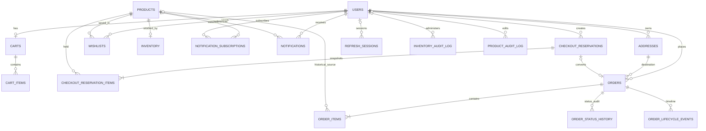

# Entity Relationships

## Core ER Diagram

Dashed/logical caveat: `Notifications.OrderId` and `ProductAuditLog.ProductId` are not foreign keys. `Products.Category` is a category-name string, not `Categories.CategoryId`. `Orders.UserId` and `Orders.AddressId` are separate FKs; same-owner relationship is checked by checkout application code rather than a composite database constraint.

## Ownership Matrix

| Entity | Owner/key | Lifecycle and deletion behavior |
| --- | --- | --- |
| User/profile | `Users.UserId` | Parent of addresses, cart, sessions, wishlist and notifications; selected child rows cascade on delete. Orders reference user without cascade, so account deletion may be blocked by order FK. |
| Product | `Products.ProductId` | Owns inventory; referenced by cart, wishlist, subscriptions and reservation items. Product delete cascades current operational links, but order item product reference is set NULL and snapshots preserve history. |
| Inventory | Unique `ProductId` | Sole stock source. Product delete cascades inventory and audit; product quantity is compatibility mirror. |
| Category | `CategoryId`, unique name | No FK to products; rename updates category text in product records; deletion removes only category row. |
| Cart | Unique `UserId` | Cart items cascade on cart delete; order creation clears items but retains cart shell. |
| Address | `AddressId` + `UserId` | Owned by one user; orders reference address. Application rejects delete when user's order points to address. |
| Reservation | `ReservationId` UUID + owner/session unique | Holds stock via reservation items; status transitions ACTIVE → RELEASED/EXPIRED/CONVERTED_TO_ORDER. Order reservation FK becomes null if reservation is deleted. |
| Order | `OrderId`, unique `OrderNumber`, user-scoped idempotency key | Parent of items, audit, status history, lifecycle. Address/user ownership checked in service. |
| Notification | `NotificationId` + `UserId` | Optional product and logical order links; cascade with user, product set null; order link has no FK. |
| Refresh session | Session UUID + user | Revocable and expires after configured token lifetime (seven days). Cascades with user. |
| Store settings | `SettingsId=1` | Singleton, updated by ADMIN; optional `UpdatedBy` FK. |
| Translation cache | SHA-256 text/language key | Shared content cache, no user ownership or retention job. |

## Data Flow Mapping

- Catalog: `Categories.CategoryName` ↔ `Products.Category`; not referentially enforced.
- Stock: `Products` 1:1 `Inventory`; `Inventory` authoritative; reservations and orders mutate quantities transactionally.
- Cart: `Users` 1:1 `Carts` → many `CartItems` → `Products`; items are deleted on successful order creation.
- Checkout: `Users` 1:N `CheckoutReservations` → snapshot lines; lines point to Products with RESTRICT; conversion links one reservation to an order.
- Order history: `Users` 1:N `Orders`; each order refers to one address and has snapshot `OrderItems`, timeline, status history and audit rows.
- User features: `Wishlists` joins Users/Products; notification subscriptions join Users/Products; `Notifications` points to user and optionally product/order.
- Admin traceability: inventory audit, product audit, order audit/status history/lifecycle link actors to Users where FK exists.

## Relationship/Deletion Risks

- Deleting a user with historical orders may fail because Orders.UserId has no ON DELETE action. Admin user deletion endpoint does not preflight this condition.
- Deleting a product removes subscriptions and inventory, but order snapshot survives with nullable product. Product audit rows lack FK and may remain orphaned.
- Deleting a category does not delete or reassign products; category strings may become dangling.
- There is no explicit image entity/table. Product images are encoded as JSON text in `Products.ImageUrl`; object metadata is external to DB.
- `AddressId` does not guarantee ownership at DB level. Keep application ownership validation on every order path.
