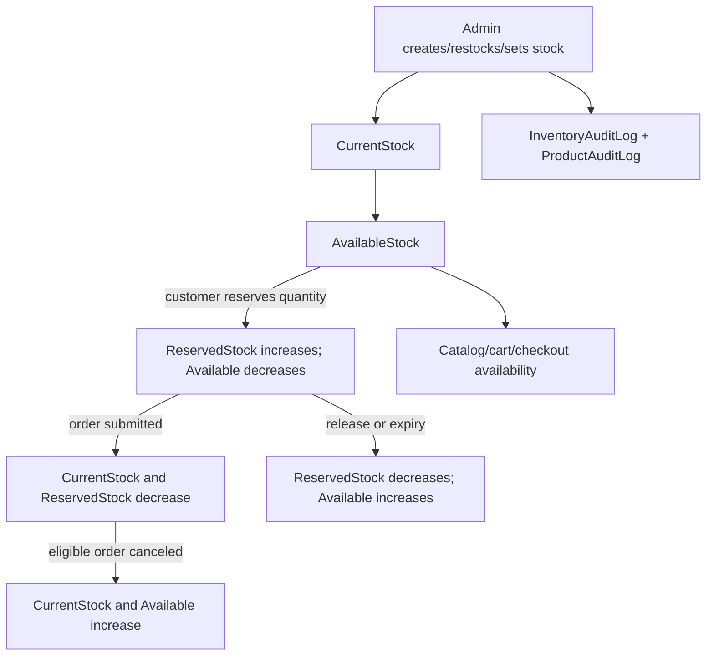

# Inventory Management

## Source of Truth and Quantities

`Inventory` is authoritative. For each product:

- `CurrentStock`: physical units still in store inventory, including units held for a checkout session.
- `ReservedStock`: units temporarily allocated to active checkout reservations.
- `AvailableStock`: units currently sellable; invariant `CurrentStock = AvailableStock + ReservedStock`.
- `SoldStock`: not stored as a separate table/column. Successful order placement subtracts quantity from `CurrentStock` and available/reserved stock; historical sales are derived from `OrderItems`/orders.
- `Products.Quantity`: compatibility mirror of `Inventory.CurrentStock`; it must not be used to calculate sellable stock.
- `Status`: `OUT_OF_STOCK` if available is zero; `LOW_STOCK` for available 1–5; otherwise `IN_STOCK`. “Temporarily Unavailable” is a presentation state when available is zero but reserved is positive.

Public products, cart, wishlist and checkout derive stock from `Inventory`. Missing inventory is treated as zero available. The API therefore fails closed for customers, though admin repair/reconciliation is required.

## Lifecycle



New product creation inserts product and initial inventory together. Startup runs one-time `InventoryMigrations` bootstrap from legacy product quantities, then synchronizes `Products.Quantity` from Inventory on every startup. It does not repeatedly overwrite Inventory from the product mirror.

## Checkout Reservation and Order Effects

1. Checkout locks the user's cart, validates address/product availability, and reads product price and quantity.
2. `reserveCart` runs transactionally: locks the cart and inventory rows, snapshots line name/prices/quantity, decreases `AvailableStock`, increases `ReservedStock`, and creates/updates an `ACTIVE` reservation. Default TTL is five minutes (`CHECKOUT_RESERVATION_MINUTES` can adjust it, minimum one minute).
3. While active, cart add/update/remove/clear returns 409 `ACTIVE_PAYMENT_SESSION`. Reservation snapshot protects QR/order amount against later cart changes; stock updates cannot reduce current quantity below reservations.
4. On order submission, a transaction consumes each reserved unit from both `CurrentStock` and `ReservedStock`; `AvailableStock` stays unchanged because it was already excluded from sale. It synchronizes product mirror, writes order/audit/history, converts reservation, and clears cart.
5. Release/cancel/expiry decreases `ReservedStock` and increases `AvailableStock`; `CurrentStock` does not change.
6. Eligible cancellation after order creation increases `CurrentStock` and `AvailableStock` for order lines. A rejected payment on a reservation-backed order also cancels and returns stock.

A payment-conflict order can be recorded as canceled with refund pending if customer says payment was made after stock was no longer available; this path does not deduct stock. Refund completion itself does not alter inventory again because the stock return occurred on cancellation.

## Admin Stock Rules

Admin can set absolute `stock` by product ID or add positive quantity through restock. Updates lock the Inventory row and reject non-integer/negative quantities and any new current stock below `ReservedStock` (`STOCK_BELOW_RESERVATIONS`). Changes update `CurrentStock`, derive `AvailableStock`, update status and `Products.Quantity`, and append inventory/product audit events. Low-stock view returns available quantity 1–5; zero stock is not included.

Availability alerts fire on the zero-to-positive `AvailableStock` transition only. Notification subscriptions are one-shot and marked inactive/sent after delivery. Updating positive stock to a different positive amount does not send this alert.

## Reconciliation Checks

Run read-only checks against a maintenance-safe connection:

```sql
SELECT p."ProductId", p."ProductName", p."Quantity" AS product_mirror,
       i."CurrentStock", i."AvailableStock", i."ReservedStock", i."Status"
FROM "Products" p LEFT JOIN "Inventory" i ON i."ProductId" = p."ProductId"
WHERE i."ProductId" IS NULL
   OR p."Quantity" <> i."CurrentStock"
   OR i."AvailableStock" + i."ReservedStock" <> i."CurrentStock";
```

A healthy result is zero rows. Review ACTIVE reservations and their expiry before manually changing stock. Never “fix” a mismatch by changing `Products.Quantity` alone; repair Inventory using a transaction and preserve reservation invariants. `InventoryAuditLog` records admin views and changes; audit volume grows with inventory-list visits because each displayed row records VIEWED.

## Risk Areas

- Inventory migration is a one-time key. If legacy quantities need reimport after that marker exists, do not delete the marker casually; prepare an explicit reconciliation plan.
- The cleanup timer is process-local every 30 seconds. Lazy release also runs during several reservation/cart calls. A stopped backend can delay background notification/cleanup, though later request paths can release expired sessions.
- Product delete cascades to Inventory, wishlists and subscriptions; order line product FK becomes null and historical name/price remain.
- Manual cancellation/reconciliation must account for whether stock was reserved, consumed, or already returned to prevent double-restocking.
- There is no standalone sold-stock ledger or reservation observability dashboard.
