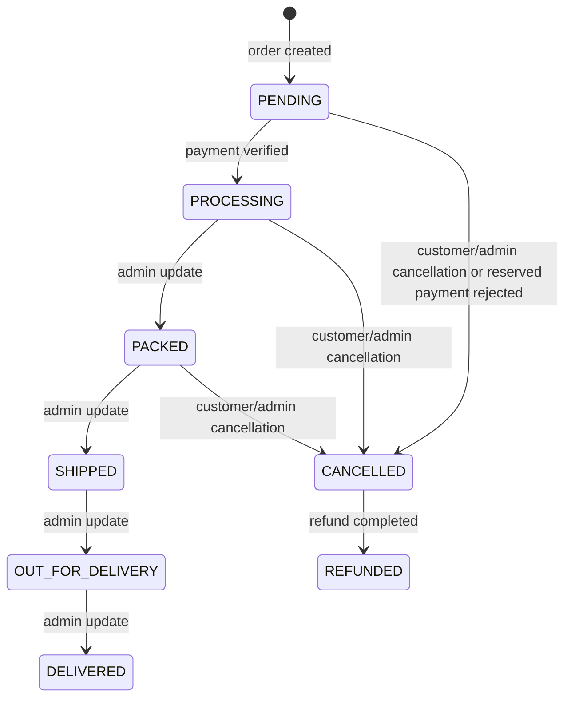
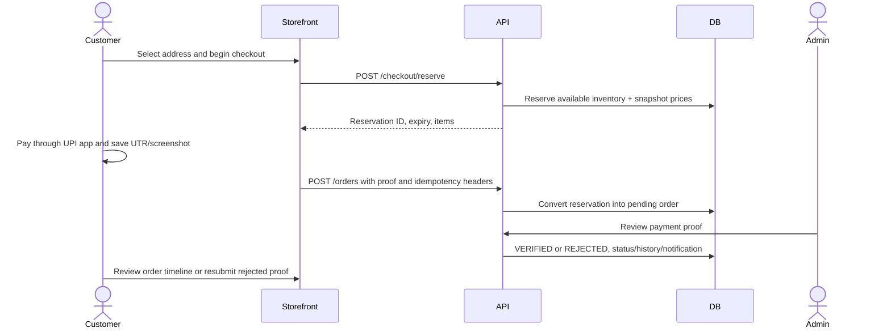
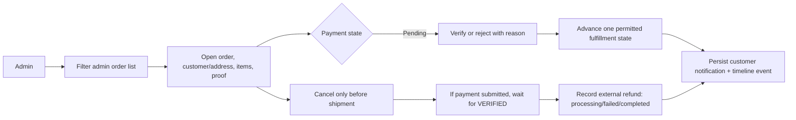

# Order Management

## Order Creation

Normal storefront flow is reservation-first. Checkout creates a timed stock reservation and immutable item/price snapshot. The browser generates a UPI QR and order reference from that reservation, then submits multipart payment details with `Idempotency-Key` and `Checkout-Reservation-Id`. The API uploads proof, validates the active owner reservation, and transactionally creates `Orders`/`OrderItems`, snapshots the selected address's `MobileNumber` as `Orders.DeliveryMobileNumber`, consumes reserved/current inventory, stores audit/status/lifecycle events, marks the reservation converted, and clears cart lines.

`OrderNumber` for reservation flow is derived from the sanitized reservation/idempotency key (prefix `VSE-` plus a short uppercase reference). Order status and payment status start `PENDING`. A database uniqueness constraint on `(UserId,IdempotencyKey)` supports retry safety. Order lines snapshot name, price/discount breakdown, quantity and image; later product changes do not rewrite purchase values.

## Status Flows

The normal allowed transitions are linear: PENDING→PROCESSING→PACKED→SHIPPED→OUT_FOR_DELIVERY→DELIVERED. Cancellation is permitted only from PENDING, PROCESSING, or PACKED. Admin cannot skip stages or move backwards. Manual UPI fulfillment cannot advance before payment VERIFIED. Payment approval of a PENDING non-cancelled order automatically sets status PROCESSING; admin sees status history and lifecycle record.

Payment state is independent: `PENDING → VERIFIED` or `PENDING → REJECTED`; rejected proof may be resubmitted for an uncancelled order, resetting payment to PENDING. Reservation-backed rejection cancels the order and restores stock. If a canceled order is verified later, refund becomes PENDING. `PaymentStatus` is stored on Orders but lacks a database CHECK constraint.

## Payment Verification and Refund

Admin inspects screenshot and UTR/reference, then marks VERIFIED or REJECTED; rejection requires reason. There is no gateway webhook or automatic transfer verification. Approved active order becomes PROCESSING and customer notification is created. Rejected reservation order becomes CANCELLED and stock is released; the customer cannot resubmit on that canceled order.

Cancellation opens `RefundStatus=PENDING` only when non-COD payment evidence was submitted. Refund lifecycle: PENDING→PROCESSING→COMPLETED or FAILED; PENDING→FAILED is allowed; FAILED→PROCESSING is retry; PROCESSING→FAILED is also allowed. All refund transitions require PaymentStatus VERIFIED. Completion sets `OrderStatus=REFUNDED`. The actual fund transfer occurs outside the application and is represented by admin action/reference only.

## User and Admin Journeys

## Timeline and Status Mapping

`OrderStatusHistory` stores each status transition and actor; `OrderLifecycleEvents` adds customer-facing titles/descriptions for order placed, payment submitted/verified/rejected, processing/shipping/delivery, cancellation and refund. Order detail APIs return both ordered by event time. Notifications are separate rows and are not the source of truth for status.

| User-facing state | Source fields |
| --- | --- |
| Awaiting payment review | `PaymentStatus=PENDING`, `OrderStatus=PENDING` |
| Confirmed/processing | `PaymentStatus=VERIFIED`, `OrderStatus=PROCESSING` |
| Payment rejected | `PaymentStatus=REJECTED`, rejection reason; reservation-backed order is CANCELLED |
| Refund pending/awaiting verification | `RefundStatus=PENDING`; actual process action waits for PaymentStatus VERIFIED |
| Refunded | `RefundStatus=COMPLETED`, `OrderStatus=REFUNDED` |
| Shipped/delivered | `OrderStatus` progression and lifecycle events |

## Cancellation and Recovery Rules

Customer orders must be owned by requester. Admin cancellation may target any order but uses the same cancellable statuses. Cancellation restores line quantities to CurrentStock and AvailableStock once. Refund does not restore stock again. If an order was paid but last stock was already consumed by another checkout, the conflict-order path preserves payment evidence in a canceled order and opens a refund case; investigate payment before refunding.

For an order/status mismatch, inspect the `Orders` row, `OrderStatusHistory`, `OrderLifecycleEvents`, reservation state, payment fields and inventory audit in one timeline. Do not directly rewrite status without recording the missing history event. Idempotent retries must reuse the same key only for the same submission; new payment sessions need a new reservation/key.
