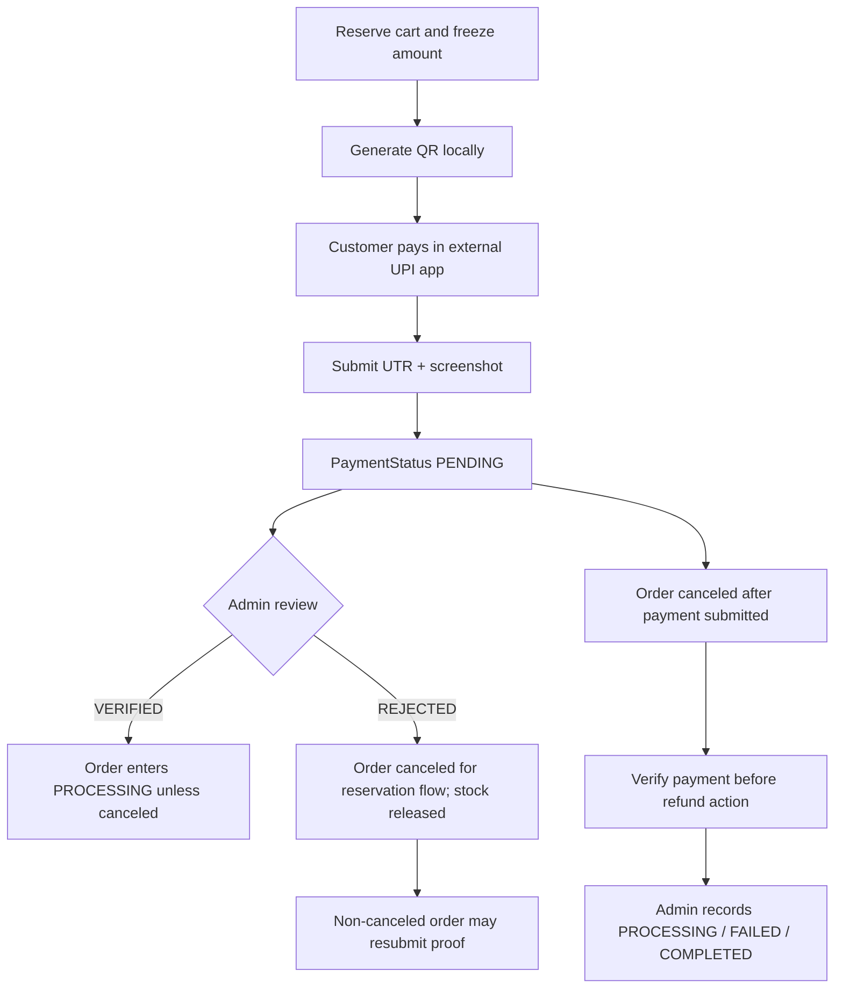

# Payment Workflow

## Current Payment Method

Only manual UPI (`UPI_MANUAL`) is exposed by checkout. There is no payment processor SDK, server-side UPI status query, webhook, settlement reconciliation, or Razorpay integration. Customer payment is external; the application stores a reference/UTR and screenshot and waits for an administrator to review it. Do not describe order placement as proof that money was received.

## QR and Amount

1. Customer picks an address. Checkout calls `POST /checkout/reserve` with a browser-persisted session ID.
2. Backend reserves cart stock and snapshots item prices/quantities/address; default hold is five minutes, configurable with `CHECKOUT_RESERVATION_MINUTES`.
3. Frontend computes amount as sum of reserved `UnitPrice * Quantity` (shipping currently zero), builds UPI URI with `VITE_UPI_ID`, payee name, INR amount and order/product note, then calls `qrcode` to render a data URL. Order reference is deterministic from reservation UUID and cached in session storage by reservation ID.
4. QR and proof fields are client-side only; no QR image or UPI URI is persisted in backend. Reload resumes active reservation and retrieves cached QR if same tab/session storage remains.
5. Customer pays in UPI application, enters UTR/reference, uploads screenshot and submits multipart order request.

`VITE_UPI_ID` is embedded at frontend build time and is required for QR creation. If absent, checkout displays a configuration error. Changing the UPI ID requires rebuilding/redeploying the frontend. The dynamic amount comes from server-locked reservation data rather than a fresh cart read.

## Session Timer and Inventory Lock

Server returns expiry and server time. Client estimates clock offset, updates countdown each second, resyncs on focus/visibility and polls reservation state every 30 seconds. Cart mutations return 409 while active. Backend cleanup runs every 30 seconds; expired reservations release stock. User can cancel before paying, which releases the reservation and clears the QR cache. The UI warns against canceling after external payment because QR/payment evidence may no longer match a future checkout.

## Proof Submission and Admin Review

Payment screenshots are stored only in the dedicated private `S3_PAYMENT_PROOFS_BUCKET`; `Orders.PaymentScreenshotKey` stores the object key. Customer order APIs never return the key or a URL. ADMIN order detail/mutation APIs mint a five-minute signed URL. The bucket must have anonymous/public reads disabled; a separate bucket name alone does not enforce its ACL. Migrate legacy public URLs before accepting production proofs.

Request: `POST /api/orders`, multipart `addressId`, `paymentMethod=UPI_MANUAL`, `paymentReference`, `paymentScreenshot`, headers `Idempotency-Key` and `Checkout-Reservation-Id`. The order stores the private object key, starts with `PaymentStatus=PENDING` and `OrderStatus=PENDING`, consumes reserved stock, and clears cart. `Idempotency-Key` is the reservation ID in the frontend, ensuring retry maps to the same order reference/order row.

Admin review at `PATCH /api/admin/orders/:id/payment` accepts VERIFIED or REJECTED; rejection requires a 3–500 character reason. VERIFIED on a non-cancelled pending order advances it to PROCESSING and creates lifecycle/notification entries. REJECTED on reservation-backed orders cancels and returns inventory. A customer may resubmit proof at `/orders/:id/payment-proof` only after REJECTED and only if the order is not cancelled.

If inventory is no longer confirmable after payment proof submission, application can retain proof in a canceled order with a pending refund. The application cannot confirm that the UPI transfer happened; staff must investigate the reference before external refund.

## Payment/Refund State Map

Cancellation refund rules: no submitted payment → `NOT_APPLICABLE`; evidence submitted → `PENDING`; admin cannot progress refund until VERIFIED. Refund COMPLETED sets order status REFUNDED. Actual money movement is manual and external to the app.

## Future Razorpay Readiness

A gateway integration should introduce server-created payment orders tied to the checkout reservation, immutable amount/currency, signed webhook verification, replay/idempotency handling, payment-event table, reconciliation job and explicit state machine. Never trust a browser success callback alone. Keep reservation/order conversion transactional and make webhook processing idempotent. Plan for failed, late, duplicate and partial refunds before replacing manual UPI; preserve current `PaymentStatus` history during migration.

## Diagnostics

- QR configuration error: verify Vercel Production `VITE_UPI_ID`, redeploy, inspect built bundle config without exposing value in logs.
- QR amount mismatch: inspect reservation items and `UnitPrice`, verify screenshot corresponds to displayed order reference, avoid changing cart while reserved.
- Session expired: inspect `CheckoutReservations` expiry/status and `Inventory` reserved counts; a new checkout creates a new snapshot/reference.
- Order not found after submission: retry only with same idempotency/reservation headers, inspect unique order key and API logs by `x-request-id`.
- Screenshot upload success but no order: possible orphan storage object; inspect API/storage/database state before asking customer to pay again.
- Never request card credentials, UPI PIN, OTP, or banking password. The app should not collect them.
