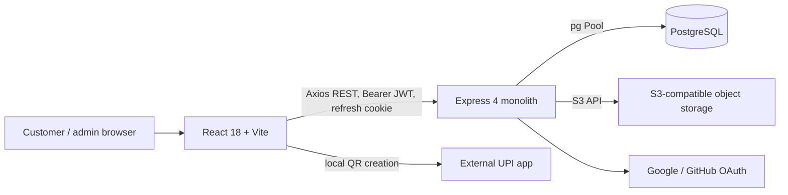

# Project Audit Report

**Audit date:** 2026-09-26  
**Scope:** Source-based pre-production audit of the Vaishnavi Silk Emporium frontend, API, database/bootstrap, authentication, business workflows, tests, and deployment configuration.

## 1. Executive Summary

This is a feature-rich, single-store commerce application implemented as a React/Vite SPA, an Express 4 modular monolith, PostgreSQL, and S3-compatible object storage. It has meaningful domain work already present: transactional reservation/order conversion, idempotency keys, explicit order history, owner-scoped customer queries, role-gated admin routes, and a usable manual-UBI review flow.

It is **not production-ready for a public commerce workload handling real customer payment evidence**. The most urgent blockers are confirmed sensitive-field logging, payment evidence stored behind generated public-object URLs, a public product DTO that exposes prices despite the intended privacy rule, and concurrency gaps in cancellation/payment transitions that can restore inventory more than once. The application also has no durable migration system, no staging/deployment promotion pipeline, no database-backed integration tests, no error monitoring/backup configuration in source, and CI does not run its existing tests.

The architecture is maintainable enough for a small team to extend cautiously, but it has grown into a feature-dense monolith without consistent route/service/repository boundaries. Several strong features are undermined by incomplete contracts: payment resubmission is unavailable for newly created reservation-backed orders after rejection, late payment after reservation expiry has no reliable reconciliation path, and the actual UPI transfer is not verified by the software.

**Recommendation:** Do not expose payment-proof uploads or rely on this application for production payment fulfillment until the P0/P1 items in this report are closed and tested. A controlled internal/staging pilot with synthetic accounts and no real payment evidence is reasonable after log redaction and storage access are verified.

## 2. Audit Method and Limits

This assessment is based on repository source, package scripts, SQL bootstrap, Postman material, and checked-in CI/deployment files. Relevant ownership surfaces include [backend/server.js](../backend/src/server.js), [backend/db.js](../backend/src/db.js), [backend/middleware.js](../backend/src/middleware.js), [frontend/App.jsx](../frontend/src/App.jsx), the route modules, tests, and [CI workflow](../.github/workflows/ci.yml).

This was not a penetration test, live database review, cloud-policy inspection, load test, accessibility certification, or recovery drill. Vercel/Render/Supabase dashboards, actual bucket ACLs, production logs/data, domain/DNS/TLS, backup schedules, current traffic, and provider plan limits are not available in this workspace. Conditional risks are labeled as such. No claim below should be read as evidence that a cloud account was tested.

## 3. Architecture Review

### Current Shape

The deployment files document Vercel for the SPA, Render for the API, and Supabase PostgreSQL/storage. The deployment itself must be verified in provider dashboards. API calls and domain data reside in one backend process; there is no message broker, separate worker, API versioning, OpenAPI contract, cache service, or real-time transport.

### Maintainability and Boundaries

- Frontend has useful shared layouts, contexts, product components, and utilities. Authentication, cart, theme, language, and notification-modal state have explicit context owners. Route-level data loading still lives mostly in pages, with no shared query cache or typed API client.
- Backend is only partially layered. Cart/inventory have controller/service/repository pieces, while product, category, auth, settings, and some admin order behavior lives directly in route modules. `order.repository.js` is a large multi-domain repository for order, payment, cancellation, refund, inventory, history, and lifecycle changes.
- `db.js` is a custom compatibility adapter that regex-normalizes SQLite-like placeholders/identifiers to PostgreSQL. It centralizes connectivity but hides SQL dialect behavior and depends on a manually maintained identifier list.
- Business logic is split between route handlers, services, repositories, and frontend state. Payment-session timing/QR and user-facing payment state are coordinated across frontend, reservation logic, order logic, and notification logic without a formal state-machine contract.
- There are no TypeScript types or generated request/response models. API response casing mixes camelCase DTOs with raw PascalCase database records.
- Some reusable patterns are present, but image URL fallback wrappers repeat across several pages/components. This is minor compared with larger separation and state-transition risks.

**Answers:** Maintainable for a small team with careful ownership; not yet scalable by default. Coupling is moderate-to-high around order/inventory/payment transitions, startup DDL, and frontend polling. Responsibilities are clear in a few modules but inconsistent across the system. Future growth is possible, but adding vendors, gateways, or high-volume catalog behavior without first formalizing contracts and persistence changes will amplify existing coupling.

## 4. Frontend and UX Review

### Strengths

- Route-level customer/admin shells are distinct; the admin guard waits for session restoration.
- Auth, cart, theme, language, and modal confirmations have shared contexts rather than pervasive prop drilling.
- The admin mobile navigation includes keyboard/focus handling; several notification/dialog flows use semantic roles and labels.
- Checkout exposes reservation expiry and warns users not to cancel after sending payment. Reduced-motion handling exists in some animated notification/product flows.
- Public/customer/admin routes cover the principal storefront workflows.

### Findings

- The frontend is client-rendered and statically imports every route page. The verified Vite build emitted a **539.61 kB minified JavaScript entry chunk (169.17 kB gzip)** and raised the 500 kB advisory. There is no bundle budget, route splitting, or performance CI gate.
- No frontend unit, component, browser E2E, visual regression, or accessibility test suite exists. `axe-core` is declared as a dev dependency but no source/test invocation was found.
- The app uses component-level fetch state and several polling timers; there is no request cache/deduplication layer, shared retry policy by domain, or standard stale/error-state abstraction.
- Header notification polling runs every five seconds per signed-in tab; catalog/detail/home polling runs around 15 seconds and cart/wishlist around 30 seconds. Per-tab request load grows linearly with open sessions.
- Customer/account route guards are inconsistent: checkout/orders use route guards; wishlist/notifications guard within a feature page; profile/settings pages handle identity locally. The backend remains the actual security boundary.
- `/privacy` and `/terms` are placeholders. StoreSettings are editable in admin, but About/Contact content is static and is not driven by those settings.
- The UI advertises a sign-in requirement for prices, but the API response is the security boundary and currently contradicts that intent (see Security).
- No HTML injection/eval sink was found by source search. React escaping is a useful baseline, not a substitute for a full XSS review or CSP tests.
- Mobile layouts and touch-oriented controls exist, but there is no automated viewport/accessibility verification, so “mobile ready” is not proven.

**Frontend assessment:** Reasonable small-app structure and interaction coverage; below enterprise quality due to untyped contracts, incomplete automated UX/accessibility tests, broad page imports, and polling-driven server state.

## 5. Backend and API Quality

### Positive Controls

- `express-validator` is used for many important forms; SQL values are generally passed as query parameters.
- JSON request bodies are capped at 1 MB; uploads are capped at 5 MB per file.
- CORS is allowlisted, Helmet is enabled, access tokens are short-lived, passwords use bcrypt, and admin/customer route guards exist.
- Reservation/order critical paths use PostgreSQL transactions and row locks in several places; order lines snapshot product prices/names/images.
- Request IDs, health endpoint, JSON-style stdout logs, centralized DB error mapping, and explicit lifecycle/status history exist.

### Findings

- **Express 4 async errors are not uniformly forwarded.** Many route handlers are `async` without local `try/catch` or a wrapper that calls `next(error)`. Express 4 does not automatically forward rejected handler promises to the four-argument error middleware. A DB/storage/provider rejection can become an unhandled rejection/process-level failure instead of the documented JSON error response.
- Route files combine validation, business decisions, SQL, storage operations, logging, and response mapping. Input validation is inconsistent and response/error shapes vary by module.
- First-time `POST /orders` only requires a truthy `paymentReference`; it does not enforce the same format used by payment-proof resubmission. The frontend format check is not a security boundary.
- The `PATCH /admin/orders/:id/status` validator accepts all `ORDER_STATUSES`, including `CANCELLED`/`REFUNDED`, while the transition map disallows direct movement to those states; separate cancel/refund routes perform those transitions. This is understandable but confusing API design.
- The order/notification/file side effects are not committed through a transactional outbox. Order state can commit and subsequent notification delivery fail; the endpoint can return an error even though the state changed, and retry may not recreate the notification.
- Some legacy order creation/conflict-order branches remain in `checkout.service.js`, but the public route now requires `Checkout-Reservation-Id`; those non-reservation paths appear unreachable over current HTTP routes and should be verified before removal.
- No API versioning, OpenAPI schema, response contract tests, pagination contract, idempotency documentation enforced by tooling, or rate limiting beyond login/register exists.

## 6. Database and Data Integrity Review

The runtime schema is created and altered by [backend/db.js](../backend/src/db.js). The archived SQL drafts are now inert; use the runtime schema and [DATABASE_SCHEMA.md](DATABASE_SCHEMA.md), not those SQL files.

### Inventory Source of Truth

`Inventory` is the operational source of truth: `AvailableStock + ReservedStock = CurrentStock`. `Products.Quantity` is a compatibility mirror. Normal product creation, stock update, order placement, cancellation, reservation rejection, and startup reconciliation synchronize the mirror. It can still diverge through direct SQL, operational scripts, future code paths that omit synchronization, or partial out-of-band imports. Startup reconciliation copies Inventory.CurrentStock back to Products.Quantity, not the reverse. This is an intentional duplicate, not an independent source of truth; monitor the invariant and avoid direct writes to the mirror.

### Integrity Strengths and Gaps

- Strong constraints exist for inventory arithmetic, nonnegative prices/quantities, status enums, unique carts, product/cart line uniqueness, wishlist uniqueness, and per-user idempotency keys.
- No general ordered migration/version history exists. Startup executes a large DDL batch plus `ALTER TABLE ... IF NOT EXISTS` and data backfills on every process start. Multiple instances/releases can race; there is no down-migration or explicit compatibility gate.
- `PaymentStatus` and `PaymentMethod` have no CHECK constraints. `Notifications.OrderId` and `ProductAuditLog.ProductId` have no FK. `Products.Category` is a string rather than a category FK. `Orders.UserId` and `AddressId` do not enforce that the address belongs to that user at DB level.
- The database does not enforce one default address per user. Application logic attempts to maintain it, but creating a first address with `isDefault=false` leaves no default; current checkout falls back to the first address.
- `Users.MobileNumber` is not unique although it is accepted as a login identifier and duplicate-registration errors imply it is unique. Multiple users can therefore share a mobile identifier, making login lookup ambiguous.
- There is no check that order totals equal item totals or that an order has at least one item. Some audit rows can become orphaned by design.
- Search uses `SELECT all active products` plus JavaScript filtering/sorting. Existing name/category indexes do not accelerate that in-memory filter.
- Admin order list similarly fetches all rows, joins/counts, then filters in application memory. No pagination or retention/archival strategy exists.
- Inventory list writes one VIEWED audit row per product returned, turning reads into N additional writes.

**Database assessment:** Good first-order stock constraints and transaction primitives, but schema evolution and several business invariants still live only in application code.

## 7. Security Review

### Critical

1. **Plaintext credentials/PII can enter logs.** `validateRequest` logs all of `req.body` on validation errors, including `password`, `confirmPassword`, `currentPassword`, and `newPassword`. The centralized error logger also spreads the request body and masks only `paymentReference`. A failed validation or DB error can therefore put plaintext credentials, email/mobile/address, or preferences into provider logs. Redact by allowlist before logging; never log raw request bodies.
2. **Payment proofs are assigned public-object URLs.** `s3-storage.service.js` builds URLs under the S3-compatible public-object path and sets `Cache-Control: public, max-age=31536000, immutable` for every folder, including `payment-proofs/` and avatars. If the bucket policy permits those public URLs as intended, screenshots containing UTR/customer data are anonymously readable to anyone who obtains the URL and can be cached long-term. Make payment proofs private, use short-lived signed reads and test anonymous access before accepting real evidence.

### High

- **Guest product price exposure:** `mapProduct` always serializes `price`, `originalPrice`, and `discountedPrice`; `canViewPrice` is only a flag. Public list/detail pass `false` for guests but do not remove price fields. This defeats the intended sign-in price policy.
- **OAuth email trust:** Google profile mapping ignores `email_verified`; account linking uses email. GitHub accepts `profile.email` without verifying it when present, only checking verified status in the fallback email list. Require provider-verified email before linking/creating accounts.
- **OAuth state is signed but not browser-bound.** State contains provider/client origin and expiry, but no per-browser nonce/correlation cookie. Review login-CSRF protections and bind state to the initiating browser session.
- **Existing access tokens survive disable/delete/password changes until expiry.** `authRequired` verifies JWT claims but does not re-check `IsEnabled` or user/session revocation. Admin disable revokes refresh sessions, not already-issued access tokens; customer password change does not revoke refresh sessions.
- **No CSRF token/origin guard.** Most protected mutations use Bearer headers, which limits classic cookie CSRF, but production refresh/logout use a credentialed `SameSite=None` cookie and no CSRF middleware exists. Define and test the cookie-auth threat model.
- **Uploads trust declared MIME type.** Multer checks `file.mimetype`, not magic bytes. Only avatars are dimension-parsed. Product/payment files are not fully decoded or malware-scanned. Product create permits one `image` plus eight `images` without a combined eight-file check; worst-case memory is up to nine 5 MB buffers per request, with no upload-specific rate limit.
- **Public translation endpoint is unauthenticated and writes an unbounded cache.** It accepts arbitrary 1–5000-character text and has no rate limiter/retention. The configured `INDIC_TRANS2_URL` is not called; the service caches source text as identity fallback.
- Login/register rate limiting is in-memory and process-local; there is no general API rate limiting. Horizontal instances do not share limiter state.
- No MFA, verified-email flow, recovery/reset flow, dependency audit/secret scan in CI, or external security monitoring is configured.

### Positive Security Evidence

- SQL values are mostly parameterized. No `eval`, `innerHTML`, or `dangerouslySetInnerHTML` sink was found in the reviewed frontend source.
- Route guards generally scope customer data by token user ID; admin APIs use an ADMIN check; public registration/OAuth create USER only. No clear arbitrary-user IDOR or role-escalation path was found in the reviewed routes.
- OAuth client origin is checked against configured exact origins/preview pattern before redirect. Product and payment filenames use random UUID object keys.

These are source-level observations, not proof against all injection, IDOR, XSS, or cloud-policy issues.

## 8. Inventory, Order, and Payment Audit

### Inventory and Concurrency

Reservation creation is comparatively strong: it locks the cart and inventory rows, moves available to reserved, snapshots items/prices, and uses expiry/release/convert statuses. Order conversion consumes current and reserved quantities in a transaction. The equality constraint provides useful defense in depth.

**Concurrency defect:** `cancelOrder`, `updatePaymentStatus`, `updateOrderStatus`, and `updateRefundStatus` read the order row without `FOR UPDATE` and do not make the state transition conditional in the final UPDATE. Concurrent cancellation/payment-review requests can both observe the same prior state. Two cancellations or a cancellation racing with payment rejection can increment inventory twice and create duplicate/conflicting history. Add row locks/compare-and-set predicates and race tests before production.

`releaseLockedReservation` updates each inventory row with a reserved-stock floor but does not check affected row count before marking the reservation released/expired. If inventory and reservation data already disagree, the reservation can be closed while stock remains unreleased. Surface and fail on this invariant violation rather than silently completing.

### Payment and Order Lifecycle

- Payment is manual UPI. QR is generated in the browser from a reservation snapshot and `VITE_UPI_ID`; the backend never checks payment settlement or amount with a provider. Admin review is the only verification.
- `Idempotency-Key` and reservation UUID protect order creation against duplicate order rows, but screenshot upload occurs **before** reservation validation/idempotency lookup. Retries, missing reservation headers, or transaction failures can orphan publicly addressed proof images.
- Reservation expiry is five minutes by default. If the customer pays externally but the reservation expires before proof submission, `createOrderFromReservation` rejects the expired reservation. The current reservation-backed path does not create the conflict/refund record for this late payment; support must reconcile manually. This is a material customer/financial risk.
- Payment rejection on a reservation-backed order automatically cancels it and restores stock. The customer proof-resubmission route/UI accepts only rejected, non-cancelled orders; therefore the resubmission feature is effectively for legacy/non-reservation orders, not new checkout orders.
- Refund status is tracking metadata only. The software does not move money or reconcile bank/UPI settlement. Cancellation with submitted proof opens PENDING; action waits for VERIFIED.
- Order status, payment status, and refund status are separate but not represented by one formal state machine. Status transitions are guarded in code but some endpoint validators advertise values that the transition map will reject.
- There is no return/RMA workflow, payment gateway, webhook signature validation, refund API integration, or automated settlement reconciliation.

**Business readiness:** The code provides a manual-review workflow, not a payment system. Real UPI funds can be sent without a reliable application record if the timer/network/order path fails.

## 9. Notifications and Integrations

Notifications are persistent rows, not real-time delivery. The header polls every five seconds; the API returns the most recent 50 while unread count covers all rows. No pagination, retention, queue, outbox, WebSocket/SSE, email or mobile push exists.

- Order/payment state commits before notification insert. A notification failure can return an HTTP error after the order state already changed; retry may not emit the missed notification.
- `sendReservationNotification` accepts a reservation ID but does not persist/use it in deduplication. Identical messages for one user across different reservations can suppress later notices.
- Back-in-stock sends notifications and marks subscriptions sequentially without one transaction/outbox; partial failure can leave some rows sent and others pending.
- Notifications are not FK-linked to Orders; dedupe checks have no unique constraint and can race.
- Browser notification/audio is opt-in and not delivery-guaranteed.
- S3-compatible storage and Google/GitHub OAuth are the only material external server integrations. Vercel Analytics/Speed Insights run in the frontend. Translation is identity fallback.

## 10. Performance and Scalability

### Measured and Confirmed

- Vite production build emits a 539.61 kB minified JS entry chunk (169.17 kB gzip) and warns above its 500 kB advisory threshold. All route pages are statically imported; no route-level lazy loading is configured.
- Public product list loads all active products, then applies keyword/category/featured filters and sort in Node. Admin orders load all joined rows and filter/search in memory. Both are unpaginated.
- Notification polling at five seconds per signed-in tab, plus product (~15s), cart/wishlist (~30s) polling, scales requests with open clients.
- Availability notification and inventory-view audit loops issue per-row queries/inserts; stock list reads produce an audit write per product.
- Images have immutable one-year cache headers, which helps product assets, but the same policy is unsafe for payment proofs. No resize/format negotiation or responsive media pipeline exists.
- PostgreSQL pool uses defaults; no explicit pool sizing, query timeout, slow-query metrics, or pool saturation alarms are configured.

### Scaling Assessment

Horizontal API scaling is possible only after schema migration coordination, request/error telemetry, and reservation-job ownership are addressed. The current in-process 30-second cleanup timer runs on every API replica; row locks reduce duplicate expiration processing but do not provide a single scheduler or notification delivery guarantee. Full-table response patterns and polling are the likely first bottlenecks, followed by DB pool sizing and unbounded audit/notification growth. Microservices are not the next step; pagination, migrations, outbox, observability and measured load tests are.

## 11. DevOps and Operational Readiness

- `render.yaml` defines a Render Node service and health path; Vercel rewrite handles SPA deep links. Supabase DB/storage target is documented, but live provider settings are not visible here.
- `.github/workflows/ci.yml` runs Node 20 install, `node --check src/server.js`, frontend install and production build on `main` push/PR. It **does not run `npm test`**, lint, DB migration tests, security scans, E2E or deploy.
- Only `main` appears in CI. No branch policy, staging infrastructure, deployment approval, or environment promotion is defined in repo. Postman UAT is a placeholder API URL, not a staging system.
- Render Blueprint omits S3 variables and `CHECKOUT_RESERVATION_MINUTES`; storage values may exist only in dashboard. Missing storage config does not fail startup but makes upload flows fail at runtime.
- `DATABASE_URL` is mandatory; production JWT/account values are validated. Configured ADMIN/USER credentials only create accounts when the username is absent; changing the env password does not rotate an existing account.
- PostgreSQL production SSL uses `rejectUnauthorized:false`, which encrypts transport but disables certificate identity validation. Validate whether provider requirements necessitate this exception; prefer proper CA validation.
- Backend logs to stdout/stderr. No external error tracker, uptime/alert rules, APM, documented SLO, or recovery drill is configured in source. Database and object backups/PITR are not configured here and must be verified with the provider.
- No graceful HTTP server close/`pool.end()` signal handling is present.
- `npm run seed` is not environment-gated and includes legacy laptop/furniture/speaker fixtures alongside sarees. Avoid running against production.

## 12. QA and Code Quality

### Current Coverage

Backend has six test files and 16 unit tests for database production config, inventory arithmetic, order pricing/reference, payment rejection reason, and product image parsing. There are no database integration tests, API contract tests, frontend tests, Playwright/E2E, accessibility automation, or load/concurrency tests. The tests cover useful pure logic but not the riskiest transactions.

CI currently does not execute the existing test suite. During this review the test command passed 16/16, and the frontend build succeeded with the bundle warning above. Passing unit tests do not establish order/inventory/payment correctness under a real PostgreSQL transaction.

### Quality Findings

- Consistent JS/ESM and domain naming are present, but the backend has uneven formatting (including mixed tabs/spaces), large route/repository modules, and repeated mapping/error patterns.
- No type checking, lint gate, API schema/code generation, or test fixture/isolated DB setup.
- `axe-core` is installed but no active test invocation was found.
- `Admin Users` APIs exist without a frontend management screen. Reports are client-derived from all admin products. Collections are a frontend catalog alias, not an entity/API.
- Translation configuration is misleading: setting `INDIC_TRANS2_URL` only changes a provider label; it does not call a translator.
- Address creation clears existing defaults when there is no default, then inserts the new row using `input.isDefault`; if the caller omits/sets false, the user still has no default. Checkout has a fallback, so this is a UX/data-quality defect rather than a checkout blocker.

## 13. Risk Register

### Critical Issues

1. Plaintext credential/body logging on validation/error paths. Immediate log redaction and retention/access review required.
2. Payment evidence generated as public URLs with long-lived public cache policy. Verify bucket ACL; make proofs private before collecting real payment evidence.

### High-Risk Issues

- Guest price values exposed despite intended policy.
- Concurrent cancellation/payment reviews can double-restock or create conflicting state/history.
- Late UPI transfer after reservation expiry has no reliable auto-record/reconciliation path.
- New reservation-backed payment rejection cancels order, making resubmission unavailable for that order.
- Sensitive uploads rely on client MIME and memory buffers; no upload rate limit/total memory ceiling.
- Async route rejections are not consistently forwarded by Express 4.
- OAuth does not explicitly enforce verified provider email and state is not browser-bound.
- CI skips tests; no real DB transaction/race tests.
- Runtime DDL has no ordered migration/version/rollback process.

### Medium-Risk Issues

- Disabled/deleted account access JWT remains usable until expiry; customer password change leaves refresh sessions active.
- Public translation writes unbounded cache rows; broad API has no general rate limit.
- Unpaginated product/admin-order reads and frequent polling.
- Notification state can be lost after domain commit; reservation dedupe is too broad.
- Missing FK/check/unique constraints for category, notification order link, product audit link, payment status, mobile identity and default address.
- Storage config, DB backup, storage backup, observability and recovery objectives are not enforced by repository config.
- Product delete/storage ordering can remove images before DB delete failure; upload failures after object creation can leave orphans.

### Low-Risk / Future Risks

- Single-store assumptions are spread across role, product, settings and stock models; multi-vendor support requires a broad tenant/data migration.
- Static translation coverage, placeholder legal routes, client-side reports, duplicated image URL wrappers and lack of API versioning add maintenance cost.
- No measured capacity baseline exists; capacity claims are not possible from source alone.

### Technical and Architectural Debt

- Startup DDL plus compatibility SQL adapter instead of versioned migrations.
- Route modules mix transport, domain policy, SQL, object storage, and event generation.
- No state-machine/outbox boundary for orders/payments/notifications.
- Duplicate Product.Quantity mirror and string category relation.
- Unbounded client polling and list APIs.
- Legacy non-reservation order paths and dead/legacy assumptions require usage analysis before removal.
- No formal staging, release, rollback, backup, or data-reconciliation drills.

### Business Risks

- UPI transfer is external and never automatically reconciled.
- Customer may pay after reservation expiry; app may reject order evidence and leave staff to reconcile manually.
- Rejected proof on a new order cancels/releases stock and cannot be resubmitted on that order.
- “Refund completed” is an admin-recorded status, not proof that money was returned.
- There is no returns/RMA flow.
- Guest price hiding is currently only a UI intent; the API reveals prices.

## 14. Numerical Ratings

Ratings are qualitative source-review scores, not measured SLOs. 10 means mature, tested, and operationally controlled for the stated scope.

| Area | Rating | Rationale |
| --- | ---: | --- |
| Architecture | 5/10 | Clear SPA/API/DB shape and some domain modules; boundaries and migration/event ownership are inconsistent. |
| Frontend Quality | 5/10 | Useful shared contexts/layouts and thoughtful flows; untyped, polling-heavy, static imports, no frontend tests. |
| Backend Quality | 4/10 | Real transaction/business logic exists; fat route/repository modules, async error propagation and validation gaps. |
| Database Design | 5/10 | Useful inventory checks/FKs/indexes; duplicated mirror, missing invariants, unversioned schema changes. |
| Security | 3/10 | JWT/bcrypt/CORS/role gates exist, offset by raw secret logging, price leakage and public-proof risk. |
| Performance | 4/10 | Small-store operation is plausible; whole-list filtering, polling, per-row writes and 539.61 kB JS chunk. |
| Scalability | 3/10 | PostgreSQL/object state can scale, but no pagination, queue, distributed job ownership, pool tuning or load tests. |
| Maintainability | 4/10 | Familiar stack and modular files; cross-layer business workflows and custom SQL compatibility increase change risk. |
| Testability | 2/10 | Pure unit tests only; no DB/API/UI/concurrency/E2E coverage and CI skips the tests. |
| DevOps Readiness | 3/10 | Hosting targets/health checks exist; staging, promotions, secrets coverage, alerts, backups and rollback drills are external/unverified. |
| User Experience | 6/10 | Feature-rich and responsive with useful checkout messaging; payment edge cases and state refresh remain fragile. |
| Production Readiness | 2/10 | Critical logging/storage/payment/concurrency controls and operational gates remain open. |

## 15. Overall Grade

**Overall grade: D (3.8/10 equivalent; production readiness is 2/10).**

The product is substantially implemented, not a scaffold, but enterprise production readiness is not established. The grade is driven by direct credential logging, potentially public payment evidence, order/inventory race conditions, incomplete payment reconciliation, weak transaction-level testing, and absent operational controls—not by the choice of React/Express or a lack of microservices.

## 16. Top 20 Improvement Roadmap

Effort: S = days, M = roughly 1–2 weeks, L = multiple weeks/design migration. Impact and residual risk refer to the recommended action.

| # | Priority | Recommendation | Impact | Risk if delayed | Effort |
| ---: | --- | --- | --- | --- | --- |
| 1 | P0 | Replace raw request-body logging with an allowlist/redactor; add regression tests proving passwords, tokens, addresses and payment data never enter logs. | Prevents credential/PII exposure. | Continued secret leakage to hosting logs. | S |
| 2 | P0 | Make payment proofs private; use short-lived signed reads, remove public immutable cache policy for sensitive files, verify anonymous access is denied. | Protects financial evidence/PII. | Anyone obtaining a URL may view retained evidence. | M |
| 3 | P0 | Lock order rows (`FOR UPDATE`) or use conditional state updates in cancel/payment/refund/status transactions; make stock return exactly-once. | Preserves inventory/order integrity under concurrency. | Duplicate restock, contradictory history, oversell. | M |
| 4 | P0 | Fix guest product DTO so price fields are absent when price access is denied; test list and detail as guest/USER/ADMIN. | Enforces stated pricing policy. | Competitor/customer access to supposedly protected prices. | S |
| 5 | P1 | Design late-payment and rejection flows explicitly: keep eligible orders retryable or provide a safe replacement/refund case; reconcile after reservation expiry. | Reduces payment loss/customer disputes. | Real transfer with no matching order/refund record. | M |
| 6 | P1 | Add Express 4 async handler wrapper or migrate to Express 5 with regression tests; forward every rejected handler to error middleware. | Predictable API failures. | Unhandled rejection/process crash on DB/provider errors. | S-M |
| 7 | P1 | Validate UTR/reference server-side on initial order, not only resubmission; add upload byte-sniff/decode, image dimension and total-memory limits. | Better input/file trust boundary. | Invalid proof, polyglot uploads, memory exhaustion. | M |
| 8 | P1 | Add ordered, versioned PostgreSQL migrations and deployment compatibility checks; remove startup DDL races. | Safe, reviewable schema evolution/rollback. | Failed or partially compatible rolling deploys. | L |
| 9 | P1 | Run `npm test` in CI; add PostgreSQL integration tests for last-unit reservation, idempotency, concurrent cancel/reject, expiry and refund transitions. | Makes business invariants verifiable. | Existing unit tests miss highest-risk defects. | M |
| 10 | P1 | Add a transactional outbox/worker for order/payment/stock notifications with unique event IDs and per-reservation dedupe. | Reliable notification delivery and retries. | State commits without customer alert; duplicate notices. | M-L |
| 11 | P1 | Enforce account enabled/revocation on protected requests or use token-version/session revocation; revoke refresh sessions on password change. | Faster account disable and credential response. | Disabled/password-changed accounts retain access until expiry. | M |
| 12 | P1 | Verify `email_verified` for OAuth providers and bind OAuth state to a browser nonce/session. | Prevents unsafe account linking/login CSRF. | Account-linking or login-CSRF risk. | M |
| 13 | P1 | Add shared rate limiting for public/search/translation/upload endpoints and set request/upload concurrency limits. | Abuse and resource-exhaustion resistance. | DB/storage/memory consumption from untrusted clients. | S-M |
| 14 | P1 | Add startup/readiness validation for S3 config, and compensate or reconcile objects after failed DB writes/deletes. | Reliable media and payment uploads. | Runtime upload outages and orphaned files. | M |
| 15 | P2 | Add DB-backed pagination/filter/search for products, orders, notifications, users and audits; cap page size. | Bounded memory, payload, and DB cost. | Full-table reads degrade with catalog/order growth. | M |
| 16 | P2 | Add missing DB constraints/relations: verified payment enum, unique default-address strategy, mobile uniqueness decision, notification/order and product-audit relationships where appropriate. | Moves critical invariants below application layer. | Data drift/orphans from new code or scripts. | M |
| 17 | P2 | Configure structured redacted monitoring, uptime/error alerts, DB pool/slow-query metrics, and reservation/payment backlog dashboards. | Shortens detection/recovery time. | Silent production degradation. | M |
| 18 | P2 | Establish staging with isolated DB/bucket/OAuth/payment identity; protect main and add approved promotion plus rollback drills. | Safer releases and config validation. | Production-only failures with no rehearsed recovery. | M |
| 19 | P2 | Reduce polling, add request caching/deduplication or SSE for notifications, code-split routes, and set a bundle budget. | Better page load and backend efficiency. | Growing client cost and unnecessary API traffic. | M |
| 20 | P2 | Add Playwright critical journeys, accessibility automation, dependency/secret scanning, seed safeguards, and privacy/retention policies. | Raises release confidence and operational compliance. | Regressions and unmanaged test/demo data. | M-L |

## 17. Production Readiness Assessment

**Current decision: No-go for unrestricted production commerce or public collection of payment screenshots.** Use only with synthetic data in an isolated environment until P0 issues are remediated.

Minimum release gate:

1. Confirm password/PII redaction with tests and inspect historical log retention/access.
2. Prove anonymous reads of payment proofs fail; migrate any existing public proof objects safely.
3. Fix guest price serialization and order/payment/cancellation race transitions.
4. Specify tested late-payment, rejection/resubmission, cancellation, and external refund reconciliation procedures.
5. Add DB integration/concurrency tests and run them in CI.
6. Introduce a staging environment and versioned migration gate; verify storage configuration before deploy.
7. Verify database/object backups and perform a restore drill; define RPO/RTO and alert owners.
8. Re-run security review against deployed CORS, cookie, OAuth, bucket, database, TLS and secret settings.

No production capacity, uptime, RTO/RPO, backup success, cloud ACL, or live OAuth/payment behavior can be certified from repository source alone.
