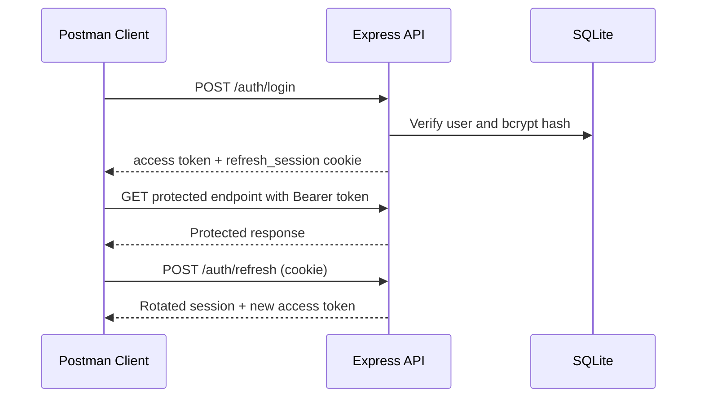

# API Coverage

## Collection Files

- `Vaishnavi-Silk-Emporium.postman_collection.json`
- `Vaishnavi-Development.postman_environment.json`
- `Vaishnavi-UAT.postman_environment.json`
- `Vaishnavi-Production.postman_environment.json`

Import the collection, select an environment, run **Authentication / Login**, and the test script stores `accessToken` for protected requests. The refresh token is deliberately an HttpOnly cookie and is therefore not exposed as a Postman variable.

## Implemented Folders

| Folder | Implemented API surface |
| --- | --- |
| Authentication | Register, login, refresh, logout, current user, profile/settings update, password update, OAuth redirects/provider state |
| Products and Search | Public catalogue, keyword/category/featured filtering, details, admin CRUD, inventory summary |
| Categories | Public active categories and protected admin CRUD |
| Wishlist | List/status/add/remove persisted wishlist entries |
| Notifications | Availability subscriptions, list, mark one/all as read |
| Translations | Cached translation service boundary |

## Authentication Flow

## Requested APIs Not Implemented

The following requested folders/endpoints do **not** exist as standalone backend resources and are intentionally excluded from the importable collection:

- Users: `/api/users`, `/api/users/:id`
- Inventory: `/api/inventory/*` (inventory updates use `PUT /api/products/admin/:id`)
- Reports: `/api/reports/*` (reports are derived client-side from `/api/products/admin`)
- Settings: `/api/settings/*` (settings use `PUT /api/auth/settings`)
- Profile aliases: `/api/profile/*` (profile uses `/api/auth/me` and `/api/auth/settings`)
- Search aliases: `/api/search/*` (search uses `GET /api/products/public?q=...`)
- OAuth POST endpoints: social auth is browser redirect based with `GET /api/auth/oauth/:provider`.

## Standardization Recommendations

1. Add versioning such as `/api/v1` before external integration.
2. Introduce dedicated Users, Inventory, Reports, and Settings route modules only when their ownership becomes server-side.
3. Add JSON Schema test scripts per response before CI-based Postman/Newman execution.
4. Keep OAuth secrets out of environments and use secret stores in UAT/production.