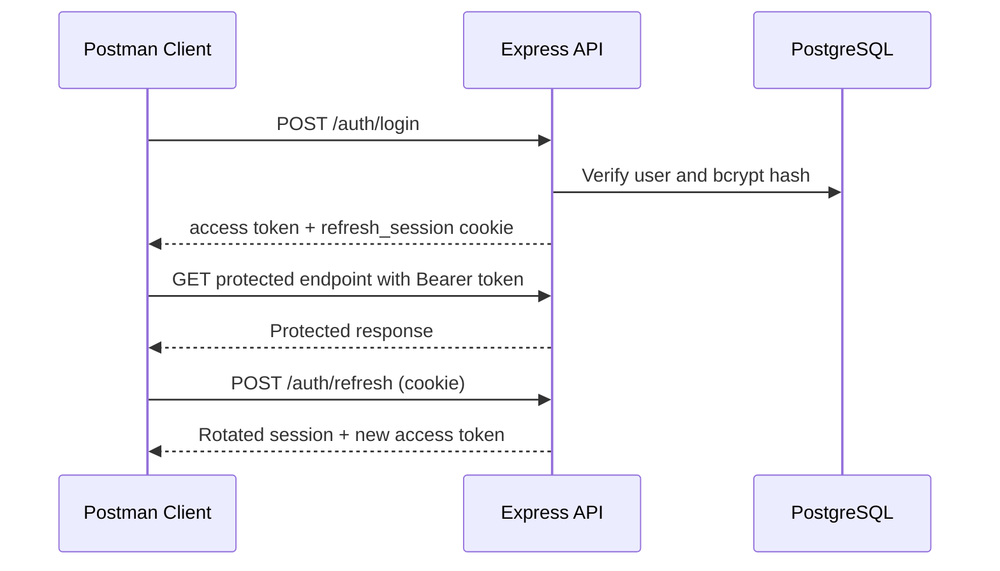

# API Coverage

This file summarizes the importable Postman collection, not the complete contract. See [API_REFERENCE.md](API_REFERENCE.md) for current routes, auth, validation, payloads, responses, and known discrepancies.

## Collection Files

- `Vaishnavi-Silk-Emporium.postman_collection.json`
- `Vaishnavi-Development.postman_environment.json`
- `Vaishnavi-UAT.postman_environment.json`
- `Vaishnavi-Production.postman_environment.json`
Import the collection, select an environment, run **Authentication / Login**, and the test script stores `accessToken` for protected requests. The refresh token is deliberately an HttpOnly cookie and is therefore not exposed as a Postman variable.

## Implemented Folders

| Folder | Implemented API surface |
| --- | --- |
| System | Health check (PostgreSQL connectivity, schema version, inventory counts) |
| Authentication | Register, login, refresh, logout, current user, profile/settings update, password update, OAuth redirects/provider state |
| Products and Search | Public catalogue, keyword/category/featured filtering, details, admin CRUD, inventory summary, product audit trail |
| Categories | Public active categories and protected admin CRUD |
| Inventory | Admin stock listing, low-stock, detail, update, legacy update-stock, restock |
| Cart | Get/add/update/remove/clear cart items |
| Addresses | List/default/create/update/delete customer addresses |
| Checkout | Cart summary, address/stock validation, inventory reservation, reservation refresh, release/expiry |
| Orders | List/detail/place from reservation snapshot (multipart + Idempotency-Key + Checkout-Reservation-Id), rejected-payment proof resubmission, customer cancellation before shipment |
| Admin Orders | List/filter/detail, status transitions, payment verification, admin cancellation, refund status updates |
| Wishlist | List/status/add/remove persisted wishlist entries |
| Notifications | Availability subscriptions, list, mark one/all as read (PATCH and legacy PUT), delete read notifications |
| Translations | Cached translation endpoint; current implementation returns source text rather than translating it |
| Settings | Admin store information read/update |
| Admin Users | List/create/update (incl. password reset)/delete admin accounts |

## Authentication Flow

```mermaid
sequenceDiagram
  participant QA as Postman Client
  participant API as Express API
  participant DB as PostgreSQL
  QA->>API: POST /auth/login
  API->>DB: Verify user and bcrypt hash
  API-->>QA: access token + refresh_session cookie
  QA->>API: GET protected endpoint with Bearer token
  API-->>QA: Protected response
  QA->>API: POST /auth/refresh (cookie)
  API-->>QA: Rotated session + new access token
```

## Order and Refund Flow

```mermaid
sequenceDiagram
  participant Customer
  participant API as Express API
  participant DB as PostgreSQL
  participant Admin
  Customer->>API: POST /checkout/reserve
  API->>DB: Hold available stock and snapshot cart/prices
  API-->>Customer: Reservation ID and expiry
  Customer->>API: POST /orders (both idempotency/reservation headers + proof)
  API->>DB: Create order from reservation; consume reserved stock
  API-->>Customer: Order created, PaymentStatus=PENDING
  Admin->>API: PATCH /admin/orders/:id/payment {VERIFIED|REJECTED}
  API->>DB: Persist payment/order state and notification
  opt Payment rejected and order remains cancellable
    Customer->>API: POST /orders/:id/payment-proof
  end
  opt Order is PENDING, PROCESSING, or PACKED
    Customer->>API: POST /orders/:id/cancel
  end
  Admin->>API: PATCH /admin/orders/:id/refund {PROCESSING|COMPLETED|FAILED}
  Note over Admin,API: Refund updates require verified payment and an open refund case
  API-->>Customer: Persisted payment/order/refund notification
```

Cancellation is independent of payment rejection: a customer may cancel an order in `PENDING`, `PROCESSING`, or `PACKED`. A rejected payment can be resubmitted only if that order is not already canceled. Reservation-backed payment rejection itself cancels the order and releases stock.

In the current checkout flow, every newly placed order is linked to a reservation, so an admin rejection cancels it and the proof-resubmission endpoint is not available for that order. Resubmission is retained for rejected, non-cancelled legacy/non-reservation orders.

The backend also registers `GET /api/auth/oauth/:provider/callback`, but it is intentionally not a standalone Postman request: Google or GitHub must return a valid, short-lived `code` and signed `state`. The collection includes provider-status and OAuth-start requests with automatic redirect following disabled so QA can verify the redirect without pretending to complete provider authentication.

## Requested APIs Not Implemented

The following requested folders/endpoints do **not** exist as standalone backend resources and are intentionally excluded from the importable collection:

- Users: `/api/users`, `/api/users/:id` (use `/api/admin/users` for admin-managed accounts)
- Reports: `/api/reports/*` (reports are derived client-side from `/api/products/admin`)
- Profile aliases: `/api/profile/*` (profile uses `/api/auth/me` and `/api/auth/settings`)
- Search aliases: `/api/search/*` (search uses `GET /api/products/public?q=...`)
- OAuth POST endpoints: social auth is browser redirect based with `GET /api/auth/oauth/:provider`.

## Standardization Recommendations

1. Add versioning such as `/api/v1` before external integration.
2. Add a customer/admin user-management UI or a reports API only if those server-backed workflows are needed; inventory and store-settings API route modules already exist.
3. Add JSON Schema test scripts per response before CI-based Postman/Newman execution.
4. Keep OAuth secrets out of environments and use secret stores in UAT/production.