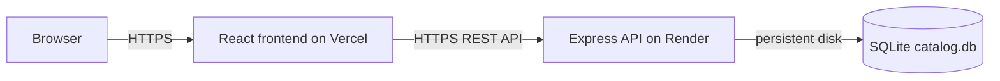

# Deployment Guide

## Architecture



## 1. SQLite Database (Current)

The current backend uses SQLite. `backend/data/catalog.db` is suitable for local development, but Render's default filesystem is ephemeral. Without a persistent disk, a redeploy or instance replacement can create a fresh database even when startup seeding is idempotent.

The Render Blueprint mounts `/var/data` and sets `SQLITE_DATABASE_PATH=/var/data/catalog.db`. Verify that this disk is attached to the live service before deploying. Do not use `DATABASE_URL` to switch the current SQLite adapter to PostgreSQL.

Uploads are also local files and require object storage for durable production media.

## 2. Supabase Database (Future Migration)

Create a Supabase project and apply `docs/supabase-schema.sql` only as part of the planned PostgreSQL migration.

### Migration Gate

The currently implemented backend uses Node's synchronous `node:sqlite` driver and `?` SQLite query placeholders. It cannot connect to PostgreSQL merely by setting `DATABASE_URL`. Before production Supabase cutover, migrate `backend/src/db.js` and all route queries to an async PostgreSQL adapter such as `pg`, use `$1` placeholders, and run integration tests. Until that migration is complete, deploy the existing backend with a persistent SQLite disk or complete the adapter work first.

## 3. Render Backend

1. Push `main` to GitHub and create a **Web Service** from the repository, or use the included `render.yaml` Blueprint.
2. Set root directory to `backend`, build command `npm ci`, and start command `npm start`.
3. Configure secrets:

```dotenv
NODE_ENV=production
CLIENT_ORIGIN=https://your-vercel-project.vercel.app
VERCEL_PROJECT_SLUG=your-vercel-project
PUBLIC_API_ORIGIN=https://your-render-service.onrender.com
JWT_SECRET=<at-least-32-random-characters>
DATABASE_URL=<supabase-connection-string-after-postgres-migration>
GOOGLE_CLIENT_ID=<optional>
GOOGLE_CLIENT_SECRET=<optional>
GITHUB_CLIENT_ID=<optional>
GITHUB_CLIENT_SECRET=<optional>
```

4. Verify `GET /api/health` returns `200` and configure this route as Render's health check.
5. For OAuth, add these Render callbacks to Google/GitHub provider settings:

```text
https://your-render-service.onrender.com/api/auth/oauth/google/callback
https://your-render-service.onrender.com/api/auth/oauth/github/callback
```

## 4. Vercel Frontend

1. Import the GitHub repository in Vercel.
2. Set **Root Directory** to `frontend` and framework to Vite.
3. Add:

```dotenv
VITE_API_URL=https://your-render-service.onrender.com/api
```

For this deployment, the value must be `https://vaishnavi-silk-emporium.onrender.com/api`. Vite injects `VITE_API_URL` at build time; changing it after deployment requires a new frontend build. `NEXT_PUBLIC_API_URL` is not used by this Vite application.

4. Deploy. The included `frontend/vercel.json` preserves React Router deep links.

The frontend normalizes a missing `/api` suffix, but set the full URL above to make the deployment configuration explicit.
5. Update Render `CLIENT_ORIGIN` with the deployed Vercel domain, then redeploy Render.

### CORS Validation

`CLIENT_ORIGIN` accepts comma-separated exact origins. `VERCEL_PROJECT_SLUG` additionally permits matching Vercel preview deployments such as `https://your-vercel-project-git-main-account.vercel.app`. Local `localhost` and `127.0.0.1` development origins are accepted automatically. Render handles `OPTIONS` preflight with credentials, `Authorization`, and `Content-Type` support.

## Production Checklist

- [ ] HTTPS URLs configured in `CLIENT_ORIGIN`, `PUBLIC_API_ORIGIN`, and `VITE_API_URL`
- [ ] Production frontend build contains no localhost API URL and targets `https://vaishnavi-silk-emporium.onrender.com/api`
- [ ] Long random `JWT_SECRET`; no `.env` file committed
- [ ] OAuth redirect URIs updated to production HTTPS URLs
- [ ] Render health check is green at `/api/health`
- [ ] Render persistent disk is attached and `SQLITE_DATABASE_PATH` points to it
- [ ] Supabase adapter migration and integration tests complete before `DATABASE_URL` cutover
- [ ] Upload storage migrated from local Render disk to object storage (Supabase Storage/S3) for durable product and avatar images
- [ ] Postman Development/UAT/Production environments updated with deployed API URLs
- [ ] GitHub Actions build workflow passes on `main`