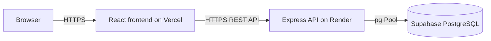

# Deployment Guide

## Architecture



## 1. Supabase PostgreSQL Database

The backend uses PostgreSQL through the `pg` Pool client. Configure `DATABASE_URL` with the Supabase pooler connection string. The app creates missing tables on startup and logs the PostgreSQL server version.

Use the Supabase pooler URL on Render, for example the Transaction or Session pooler on port `6543`. Do not commit the database password to the repository.

Uploads are also local files and require object storage for durable production media.

## 3. Render Backend

1. Push `main` to GitHub and create a **Web Service** from the repository, or use the included `render.yaml` Blueprint.
2. Set root directory to `backend`, build command `npm ci`, and start command `npm start`.
3. Configure secrets:

```dotenv
NODE_ENV=production
CLIENT_ORIGIN=https://your-vercel-project.vercel.app
VERCEL_PROJECT_SLUG=your-vercel-project
PUBLIC_API_ORIGIN=https://your-render-service.onrender.com
JWT_SECRET=<at-least-32-random-characters>
DATABASE_URL=<supabase-pooler-connection-string>
GOOGLE_CLIENT_ID=<optional>
GOOGLE_CLIENT_SECRET=<optional>
GITHUB_CLIENT_ID=<optional>
GITHUB_CLIENT_SECRET=<optional>
```

4. Verify `GET /api/health` returns `200` and configure this route as Render's health check.
5. For OAuth, add these Render callbacks to Google/GitHub provider settings:

```text
https://your-render-service.onrender.com/api/auth/oauth/google/callback
https://your-render-service.onrender.com/api/auth/oauth/github/callback
```

## 4. Vercel Frontend

1. Import the GitHub repository in Vercel.
2. Set **Root Directory** to `frontend` and framework to Vite.
3. Add:

```dotenv
VITE_API_URL=https://your-render-service.onrender.com/api
```

For this deployment, the value must be `https://vaishnavi-silk-emporium.onrender.com/api`. Vite injects `VITE_API_URL` at build time; changing it after deployment requires a new frontend build. `NEXT_PUBLIC_API_URL` is not used by this Vite application.

4. Deploy. The included `frontend/vercel.json` preserves React Router deep links.

The frontend normalizes a missing `/api` suffix, but set the full URL above to make the deployment configuration explicit.
5. Update Render `CLIENT_ORIGIN` with the deployed Vercel domain, then redeploy Render.

### CORS Validation

`CLIENT_ORIGIN` accepts comma-separated exact origins. `VERCEL_PROJECT_SLUG` additionally permits matching Vercel preview deployments such as `https://your-vercel-project-git-main-account.vercel.app`. Local `localhost` and `127.0.0.1` development origins are accepted automatically. Render handles `OPTIONS` preflight with credentials, `Authorization`, and `Content-Type` support.

## Production Checklist

- [ ] HTTPS URLs configured in `CLIENT_ORIGIN`, `PUBLIC_API_ORIGIN`, and `VITE_API_URL`
- [ ] Production frontend build contains no localhost API URL and targets `https://vaishnavi-silk-emporium.onrender.com/api`
- [ ] Long random `JWT_SECRET`; no `.env` file committed
- [ ] OAuth redirect URIs updated to production HTTPS URLs
- [ ] Render health check is green at `/api/health`
- [ ] `DATABASE_URL` points to the Supabase pooler connection string
- [ ] Render startup logs show `PostgreSQL database connected` and no SQLite path
- [ ] Upload storage migrated from local Render disk to object storage (Supabase Storage/S3) for durable product and avatar images
- [ ] Postman Development/UAT/Production environments updated with deployed API URLs
- [ ] GitHub Actions build workflow passes on `main`